# CorrTrack v2 — the 13 candidate indexes

> 📚 See also: [SKETCHES.md](SKETCHES.md) (the 5 sketch methods upstream of the
> index) · [fillcorr.md](fillcorr.md) (alternative FilCorr algorithm) ·
> [README.md](README.md) (overview).


Every index solves the **same task**: given the *sketch* (random-projection
vector) of the current window, quickly find the already-seen windows whose
sketch is *close enough* — so that the exact correlation (Pearson) is validated
on that handful of candidates only instead of on every pair.

They differ by their **data structure** (hence by the speed / selectivity /
insertion-cost trade-off).

| Index | Type | Indexed coord(s) | Parameters used | Query complexity |
|---|---|---|---|---|
| `grid` | LSH multi-grid | first `grid_n_coords` | **`grid_cell`** (step) · **`grid_n_tables`** (vote) · **`grid_vote_min`** (AND threshold) · **`grid_n_coords`** (coords) | amortized O(1) |
| `tree` | linear scan | all (`n_vectors`) | **`query_radius`** (radius) | O(N) |
| `kdtree` | generic k-d tree | all (`n_vectors`) | **`query_radius`** (radius) | O(log N + k) |
| `quadtree` | 2D tree | `quadtree_proj_dim` (JL projection) | **`query_radius`** (radius) · **`quadtree_proj_dim`** (default 2) | O(log N + k) |
| `bptree` | **1D sorted list** (bisect) | 1 (= `sketch[0]`) | **`query_radius`** (radius) | O(log N + k) |
| `bst` | **AVL binary tree** (real tree) | 1 (= `sketch[0]`) | **`query_radius`** (radius) | O(log N + k) |
| `octree` | 3D tree (8 octants) | **3D** (JL sketch-of-sketch) | **`query_radius`** (radius) | O(log N + k) |
| `knn` | k neighbours through `argpartition` | all (`n_vectors`) | **`n_neighbors`** (k, **no radius**) | O(N) (BLAS batch) |
| `bptree3d` | 3D sorted list + 1D bisect | 3D (JL sketch-of-sketch) | `query_radius` | O(log N + k) |
| `bst3d` | 3D AVL + range query | 3D (JL sketch-of-sketch) | `query_radius` | O(log N + k) |
| `hnsw` | hierarchical navigable small-world graph | all (`n_vectors`) | **`query_radius`** OR **`n_neighbors`** (kNN) · `hnsw_m` · `hnsw_ef_c` · `hnsw_ef_s` | amortized O(log N) |
| `vptree` | vantage-point tree (split by distance to the pivot) | all (`n_vectors`) | **`query_radius`** (radius) | O(log N + k) |
| `annoy` | forest of random-projection trees (RPForest) | all (`n_vectors`) | **`query_radius`** · `annoy_n_trees` · `annoy_leaf_size` | O(log N) per tree |

Parameters shared by **all of them** (upstream/downstream of the index):
`n_vectors` (sketch dimension), `seed` (projection seed), `sketch_threshold`
(downstream cosine filter), `corr_threshold` + `neg_corr` (Pearson validation),
`std_threshold` (skips near-constant windows, v1 alignment).

They all return `(series, time)` **keys**; the downstream Pearson validation
guarantees **precision**; the index only affects **recall**.

---

## `grid` — LSH multi-grid (`MultiGridIndex`)

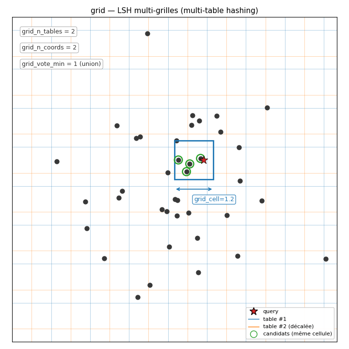

**Idea.** Discretize the first `grid_n_coords` sketch coordinates into cells of
side `grid_cell`. Two windows whose sketches fall into the same cell are
candidates. So as not to miss pairs close to a boundary, **`grid_n_tables`
shifted grids** (different offsets) are used and the pair is required to
co-occur in **at least `grid_vote_min`** grids (vote).

**Insertion.** For each grid, hash the position → append to the bucket.

**Query.** For each grid, O(1) lookup of the current window's bucket →
union/vote of the collisions, filtered by `grid_vote_min`.

**Key parameters:**
- `grid_n_coords`: number of coords used (1 = very permissive, more collisions;
  high = more discriminant but a noisier sketch).
- `grid_cell`: cell size. Tied to the correlation threshold (LSH theory:
  `cell ≈ √(2·(1−thr))` for unit sketches).
- `grid_n_tables`: 8–32 typical; more = better odds of catching a boundary pair.
- `grid_vote_min`: 1 = union (loose, maximum recall); ≥2 = AND (more selective,
  **LSH amplification**).

**Strengths / weaknesses.** Very fast insertion/query. Selectivity tunable
through `grid_vote_min`. Sensitive to boundaries (mitigated by
`grid_n_tables`).

---

## `tree` — Linear scan (`TreeIndex`)

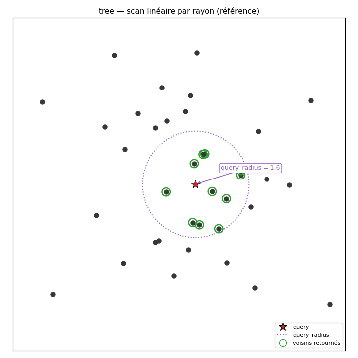

**Idea.** Not really a tree — this is the **reference** implementation: every
sketch is stored, and at each query the Euclidean distance to **all** the others
is computed, keeping those ≤ `query_radius`.

**Insertion.** Stored in a `key → vec` dict.

**Query.** Batch distance through the backend (`distance_batch`) over the whole
matrix of stored sketches → mask ≤ `query_radius`.

**Parameter:** `query_radius` — the only threshold. Larger = more candidates,
more recall.

**Strengths / weaknesses.** Simple, exact (returns *all* the pairs at distance ≤
radius). O(N) per query: fine for small N (a few thousand) with a
vectorized/MPS backend; slow on large N (prefer `kdtree` or `bptree`).

---

## `kdtree` — Generic n-dim k-d tree (`KDTreeIndex`)

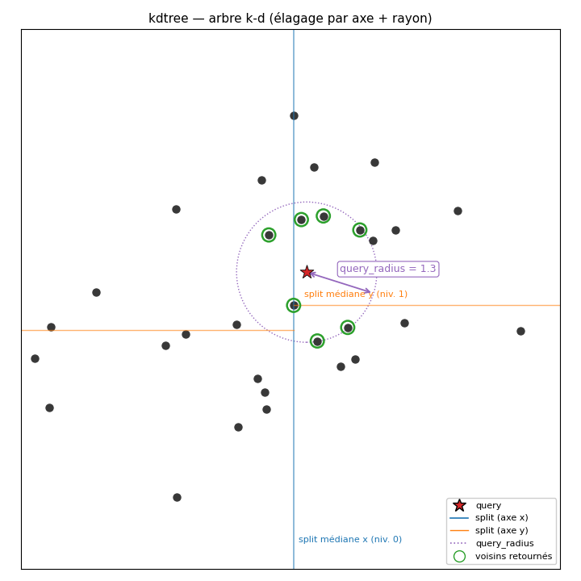

**Idea.** Build a **binary tree** where each node separates the space with a
**hyperplane perpendicular to an axis** (axis = depth mod `n_vectors`). On a
radius query, the sub-trees whose sphere does not cross the plane are
**pruned**.

**Insertion.** Marks the tree "dirty"; **lazy** rebuild at the next query
(median per axis → balanced tree, O(N log N) per rebuild).

**Query.** Recursive traversal with pruning: typically O(log N + k) (k = number
of results), far better than the linear scan as soon as N gets large.

**Parameter:** `query_radius`.

**With a non-python backend.** The tree traversal is sequential Python — when
`--candidate-backend` is `vectorized`/`cython`/`mps`, the index **falls back to
a batched linear scan through the backend** (same candidate set, often faster
than the Python tree on small N).

**Strengths / weaknesses.** Good asymptotic complexity. The lazy rebuild saves
on bursts of insertions. Expensive in very high dimension (the curse of
dimensionality reduces the pruning).

---

## `quadtree` — 2D tree over a projection (`QuadTreeIndex`)

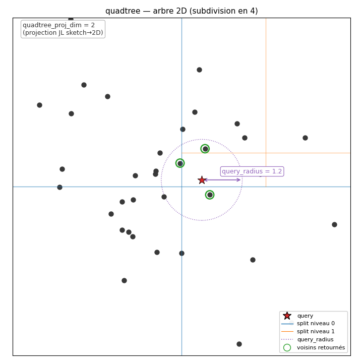

**Idea.** A quadtree is **2D** by nature; since the sketches are
high-dimensional, they are **projected to 2D** through a **random JL
projection** (dimension `quadtree_proj_dim`, default 2). The 2D space is
recursively subdivided into **4 quadrants**; a leaf splits when its capacity
(`_CAP = 8`) is exceeded.

**Insertion.** Lazy rebuild (like kdtree).

**Query.** Recursive descent into the quadrants that intersect the disc of
radius `query_radius` around the query (in 2D).

**Parameters:** `query_radius`, `quadtree_proj_dim` (usually 2).

**Strengths / weaknesses.** Very fast in 2D, but the indexing **only uses 2
coords** out of the sketch's `n_vectors` → less discriminant than `kdtree`,
which exploits every dimension. Broader recall at equal `query_radius`
(precision is saved by the downstream Pearson validation).

---

## `bptree` — 1D sorted list + refinement (`BPTreeIndex`, v1 port)

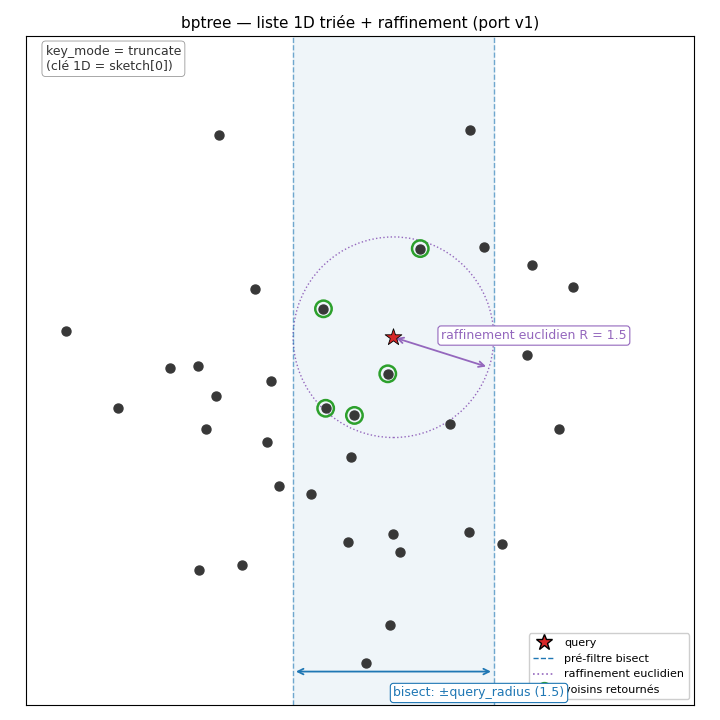

> ⚠️ **The name "bptree" is a v1 legacy and is misleading**: despite the name,
> this is **not** a tree (binary or B+tree) in the data-structure sense — it is
> a **sorted list** maintained through the `bisect` module (binary search over a
> Python array). The "dichotomy" applies to the comparisons (binary *search*),
> not to the structure (no nodes, no pointers, no children). Semantically
> equivalent to a B+tree for the interval query (O(log N) + segment scan) —
> just implemented more simply (at the price of an O(N) insertion because of the
> array shift).

**Idea.** Store the sketches in a **list sorted by their 1st coordinate**
(`sketch[0]`). On a query, **`bisect`** instantly isolates the window
`[v0−tau, v0+tau]` on that coord (a necessary but not sufficient pre-filter),
then **refinement** through the full Euclidean distance `‖a−b‖ ≤ tau` (= the
true radius-query condition).

Mathematically equivalent to a **radius query** (same candidates as
`kdtree`/`tree`), just accelerated by the 1D pre-filter.

**Insertion / deletion.** `bisect.insort` / `bisect_left` + pop — O(log N) for
the search, O(N) for the shift (acceptable up to a few 10⁴ points).

**Query.** `bisect_left/right` (O(log N)) → scan of the (often small)
sub-segment → batched Euclidean refinement through the backend.

**Parameter:** `query_radius`.

**v2 specifics.** This is the index used by v1 (`BalancedIndex` in
`candidate_kernels.py`). On the 5_1 test it yields **exactly the same set as a
`kdtree`** (~580k candidates at `query_radius=2`, recall 0.904), but is **~25%
faster** (the 1D pre-filter + bisect cuts a great deal before the distance
computation).

**Strengths / weaknesses.** Very fast; benefits from the **1D pre-filter** when
the 1st sketch coord is informative. If all coords are equivalent, it degrades
into a linear scan of the post-bisect candidates. Recommended default to
reproduce the v1 behaviour.

---

## `bst` — Real binary tree (self-balancing AVL) (`BSTIndex`)

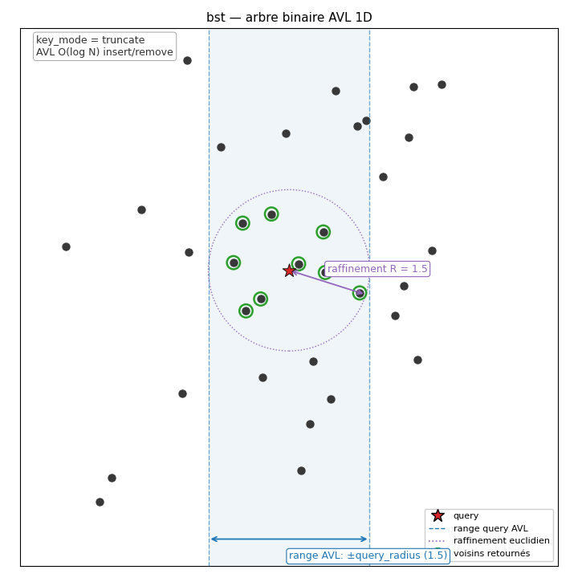

**Idea.** The "honest tree" variant of `bptree`: a **real** AVL binary search
tree (with **nodes, left/right children, rotations**), 1D key = `sketch[0]`.
Guarantees **O(log N) everywhere** (insertion, deletion, range query) where
`bptree` pays O(N) on insertion (shifting the sorted array).

**Insertion.** Classic BST + AVL rebalancing (LL/LR/RL/RR rotations if
`|height(left) − height(right)| > 1`). Guaranteed O(log N).

**Deletion.** BST with in-order successor, then rebalancing. O(log N).

**Query.** `_range(root, v0-tau, v0+tau)`: in-order descent that prunes the
sub-trees which cannot intersect the window → candidate list → full Euclidean
refinement `‖a−b‖ ≤ tau` (batched through `backend.distance_batch`).

**Parameter:** `query_radius`.

**Strengths / weaknesses.** Same candidates as `bptree`/`kdtree` (verified).
Insertion cost **really** O(log N) (useful with many bursty
deletions/insertions). More code, slightly more constant overhead than `bptree`
on small volumes.

**Choosing between `bptree` and `bst`:**
- `bptree` (sorted list): O(N) insertion but a very low constant, ideal for
  sketches that accumulate and are evicted slowly.
- `bst` (AVL): guaranteed O(log N) everywhere, preferable if N is large AND
  insertions/deletions are very frequent.

---

## `octree` — 3D tree (8 octants) with sketch-of-sketch (`OctreeIndex`)

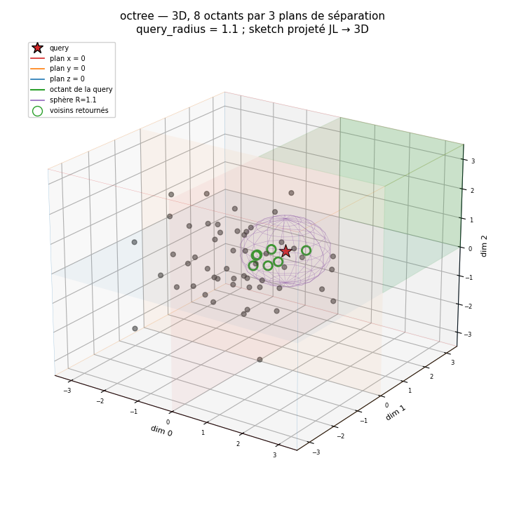

**Idea.** The 3D variant of the quadtree. Instead of truncating the sketch to
its first 2 coordinates (information thrown away), the n-D sketch is
**re-projected** to 3D through a **random projection** ("sketch of sketch") —
Johnson-Lindenstrauss guarantees that Euclidean distances are preserved up to
(1 ± ε). Recursive subdivision: **8 octants** indexed by
`(x>cx, y>cy, z>cz)` (vs 4 quadrants in 2D).

**Insertion.** Lazy rebuild (like kdtree/quadtree).

**Query.** Recursive descent into the **octants that intersect the sphere** of
radius `query_radius` around the query (in the projected 3D space).

**Parameters:** `query_radius` (radius), `n_vectors` (input sketch dimension),
`seed` (projection seed).

**Strengths / weaknesses.** A compromise between `quadtree` (2D, broad) and
`kdtree` (n-dim, tight): in 3D the JL projection preserves distances better than
in 2D, hence **fewer false candidates** than the quadtree, without paying the
kdtree's n-D pruning. The v2 quadtree also uses the random projection when
`n_vectors` is passed (which is the case through the pipeline).

---

## `knn` — k Nearest Neighbors (`KNNIndex`)

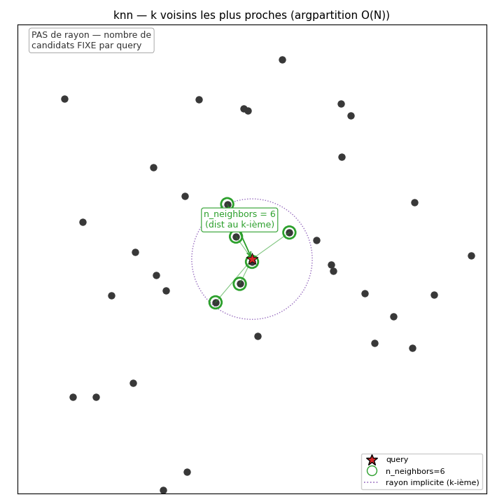

**Idea.** Instead of a radius, return **the k nearest neighbours** (through
`numpy.argpartition`, O(N), not O(N log N)). The number of candidates per query
is **fixed = k**, independent of the local density.

**Parameter:** `n_neighbors` (k).

**Advantages.** Predictable (always `k × n_series` candidates per window). Free
of the radius pitfall (too broad = explosion; too tight = recall collapses).
Suffers less in very dense regions. On a small dataset it may produce distant
candidates on isolated windows (filtered by the downstream Pearson).

## `bptree3d` / `bst3d` — 3D versions (sketch-of-sketch)

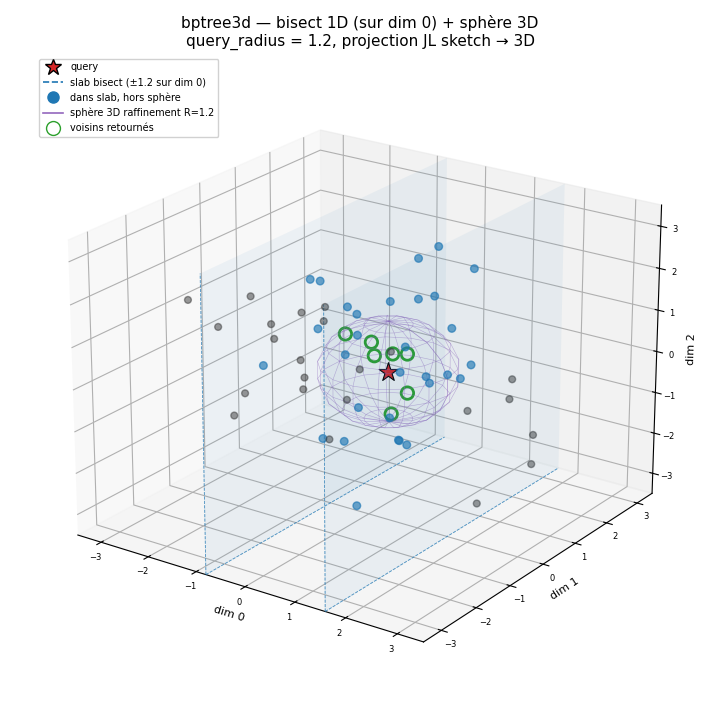
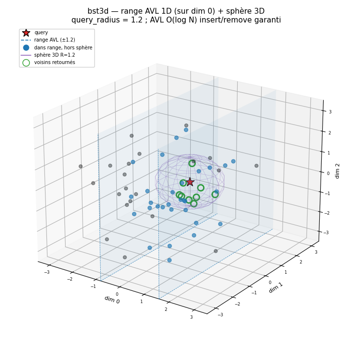

**3D** variants of `bptree` (sorted list + bisect) and `bst` (AVL). The sketch
is projected to 3D through a random JL projection
(`_projection.make_random_projection`, ~ N(0, 1/3)). Bisect/range is done on the
**1st projected coord**, refinement through the **3D Euclidean distance** over
the projected coords.

Candidate set **identical to `octree`** (same 3D radius query), just implemented
with a 1D-sorted index instead of an 8-octant spatial subdivision. Useful to
compare the insertion/query performance of the three 3D approaches.

---

## `hnsw` — Hierarchical navigable graph (`HNSWIndex`)

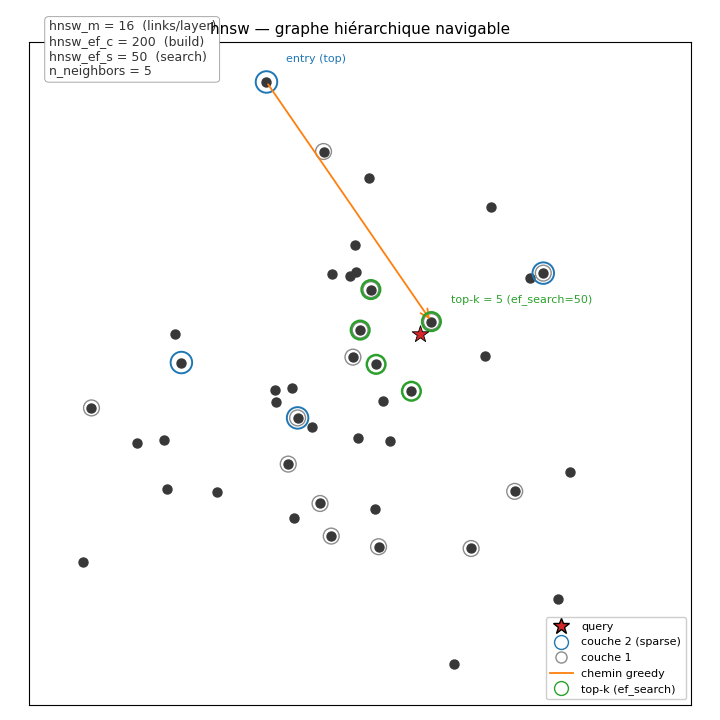

**Idea.** Instead of a tree, build a **multi-layer graph**: each point is
inserted at a random level (geometric law), and each level only involves the
points whose level is ≥. The higher you go, the **sparser** the graph
(≈ "zoom out"). A query descends **greedily** from the top (few nodes, long
jumps) down to level 0, where it is refined through an `ef_search` queue ordered
by distance.

**Insertion.** Draw the level `l` (law `floor(-ln(U)/ln(M))`); at every level ≤
l, connect the new point to its M nearest neighbours already present (heuristic
selection: links varied in distance are kept to preserve navigability). Cost ≈
O(log N · M · ef_construction).

**Query.** Greedy from the top → level 0 → expansion through a queue of size
`ef_search`. Radius mode: every point at distance ≤ `query_radius` is kept. kNN
mode: the `n_neighbors` nearest are kept (and the radius is ignored).

**Parameters:**
- `query_radius` (radius mode) OR `n_neighbors` (kNN mode; if
  `query_radius=None`).
- `hnsw_m`: max number of connections per level > 0 (16 by default; 2·M at level
  0).
- `hnsw_ef_c`: queue size during construction (graph quality; 200).
- `hnsw_ef_s`: queue size during the query (result quality; 50). Larger = better
  recall but slower (the real recall ↔ speed knob).

**Strengths / weaknesses.** **State-of-the-art reference for high-dimensional
ANN** (FAISS, qdrant, milvus). Very good recall at equal time, sub-linear query
(≈ O(log N)). High memory cost (graph → M·N pointers). Slow construction vs a
kdtree (the level pre-sort + the greedy pass at each insertion).

---

## `vptree` — Vantage-point tree (`VPTreeIndex`)

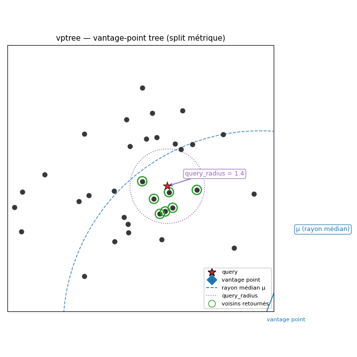

**Idea.** A **metric binary tree**: at each node a **pivot point** (the "vantage
point") is chosen and the other points are **partitioned** by their **distance
to the pivot**: ≤ median → left sub-tree, > median → right. Unlike the kdtree
(which separates by axis), **no coordinate assumption** is made — the separation
is purely metric, which makes it robust in high dimension.

**Insertion.** Marks the tree "dirty" → lazy rebuild at the next query (pivot
selection + distance computation + median split, O(N log N) overall).

**Query.** For a point q with radius R:
- compute `d = d(q, pivot)`;
- visit the left sub-tree if `d − R ≤ μ` (the ball may reach into it);
- visit the right sub-tree if `d + R > μ` (same);
- keep the pivot if `d ≤ R`.
Favourable case: a single sub-tree visited → massive pruning. Degenerate case (q
on the boundary): both sides visited, degrades to a full loop.

**Parameter:** `query_radius`.

**Strengths / weaknesses.** **Holds up well in high dimension** (no axis curse,
unlike the kdtree whose pruning becomes useless beyond ~20 dims). Simpler than
an HNSW (a single tree, no M/ef tuning). The pruning depends on the dataset
spread: on a very spread-out cloud → excellent; on a very concentrated cloud →
little benefit.

---

## `annoy` — Random-projection forest (`AnnoyIndex`)

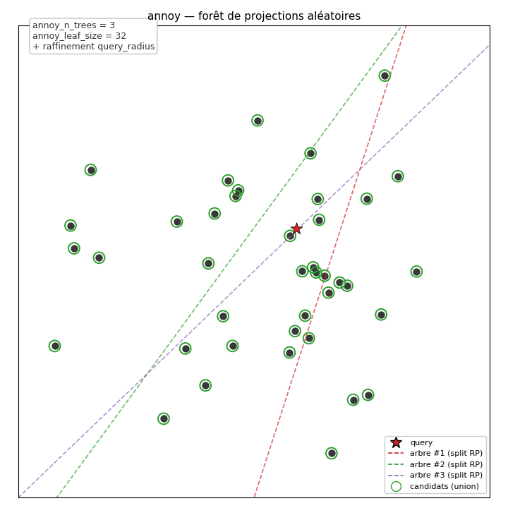

**Idea.** **N trees** (`annoy_n_trees`) built independently, each recursively
**split by a random hyperplane** (a vector passing between two randomly drawn
points, like "2-means lite"). Each tree therefore divides the space differently;
for a query, we **descend into every tree** down to the leaf, then take the
**union** of the points of the leaves reached as candidates. The more trees, the
more pairs caught (recall ↑).

**Insertion.** Marks the forest "dirty" → lazy rebuild of the N trees at the
next query.

**Query.** For each tree, deterministic descent to q's leaf (O(log N)); union of
the leaves; Euclidean refinement by radius `query_radius` over the union
(batched). Total: ≈ `annoy_n_trees × log(N) + |∪|` distances.

**Parameters:**
- `query_radius` (refinement radius).
- `annoy_n_trees`: number of trees (recall ↔ cost; typically 8-50).
- `annoy_leaf_size`: max size of a leaf before the split stops (32 by default;
  below that, linear scan).

**Strengths / weaknesses.** **Embarrassingly parallel** (each tree is
independent). Widely used in production (Spotify). **Stochastic** variability
(two runs with different seeds give different candidate sets). Lower recall than
HNSW at equal time on ANN benchmarks, but far simpler to implement / debug.

---

## Choosing the 1D key for `bptree`/`bst` (`key_mode`)

> ⚠️ **`bptree` and `bst` ALWAYS stay 1D**, whatever `key_mode` and
> `key_proj_dim` are. The extracted key is **a scalar** (a single `float`) on
> which bisect / AVL range is performed. See `steps/index/_keyfn.py:make_key_fn`,
> which systematically returns `float(...)`. To index in 3D, use `bptree3d` or
> `bst3d` (different indexes, `_keyfn.py:make_proj_fn`).

For the 1D-sorted indexes `bptree` and `bst`, the **key** extracted from the
sketch (`n_vectors`-D) is configurable:

| mode | 1D key | Lipschitz-1? | use |
|---|---|---|---|
| `truncate` (default) | `sketch[0]` | ✓ | the v1 convention; sound bisect |
| `median` | `median(sketch)` | ✗ | heuristic bisect (recall may suffer, precision saved by the downstream Pearson) |
| `sum` | `sum(sketch)` | ✗ (Lipschitz √n) | same |
| `abs_sum` | `sum(\|sketch\|)` | ✗ (Lipschitz √n) | L1 energy of the sketch — sign-invariant (useful if the sketch can flip sign between similar windows); precision saved by the downstream Pearson |
| `random` | `mean(R · sketch)`, R ∈ ℝ^(d×n) | ✓ (R unit) | 1D sketch-of-sketch; robust alternative to `truncate` |

The **`key_proj_dim`** parameter only matters for `random`: it is `d`, the
number of averaged random projections (1 by default = a single projection; >1 =
a more stable average).

⚠️ For `median`/`sum`/`abs_sum`, the bisect pre-filter is no longer guaranteed
free of false negatives (not Lipschitz-1) — recall may drop. Precision is saved
by the downstream Pearson validation.

## The downstream pipeline (shared by every index)

Whatever the structure:

1. **Sketch**: the current window is projected into `n_vectors` values
   (`backend.project`) then normalized (`znormalize`).
2. **Insert**: its sketch enters the index.
3. **Query**: the neighbours are searched (depending on the index) — that is
   what this page is about.
4. **Cosine filter** (`validate_sketches`): prunes the pairs whose sketch cosine
   is < `sketch_threshold` (often inoperative in practice: the index radius
   already implies a high cosine).
5. **Pearson validation**: the **true** correlation of the raw windows is
   computed; those ≥ `corr_threshold` are kept (with `neg_corr` → `|corr|`).

→ The validation guarantees **precision = 1.0** (zero false positives); the
indexes are only there to **reduce the number of pairs to validate**.

### Batch query (1 call for the whole window)

The radius indexes (`tree`/`bptree`/`kdtree`/`quadtree`/`octree`/`bst`/
`bptree3d`/`bst3d`/`vptree`/`annoy`) expose `query_batch(queries)`, which calls
**`backend.cdist_batch(Q, P)`** once (distance matrix through a single BLAS
matmul) instead of N separate queries. So does `knn` (batched top-k through
`argpartition` over the cdist matrix). `hnsw` keeps its per-query greedy pass
(the graph cannot be batched). `grid` falls back to the sequential loop (hash,
not Euclidean). MPS overrides `cdist_batch` with `torch.cdist` (1 host↔device
transfer instead of N). Measured: **×2.6 to ×4.1** on 5 queries/window × 3500
64-D points; the gain grows with n_series (×10-20 on 50 series).

---

## Choosing an index (in practice)

| Need | Choice | Why |
|---|---|---|
| Reproduce v1 | **`bptree`** | faithful port of `BalancedIndex` |
| Real 1D tree (guaranteed O(log N)) | **`bst`** | self-balancing AVL, same candidates as `bptree` |
| 3D with a JL projection | **`octree`** | best quadtree (2D)/kdtree (n-D) compromise |
| Reference/debug | `tree` | linear scan, transparent behaviour |
| Large volumes, high dim | `kdtree` | efficient per-axis pruning |
| **Very high dim, best ANN recall** | **`hnsw`** | ANN reference; `hnsw_ef_s` sets the trade-off |
| Robust in high dim, simple | **`vptree`** | purely metric (no axis) |
| Embarrassingly parallel, simple | **`annoy`** | N independent trees, stochastic |
| **Fixed k neighbours** (no radius) | **`knn`** | predictable candidates, ideal for a fast scan |
| Pre-projected 2D data | `quadtree` | very fast in 2D |
| Maximum recall (LSH) | `grid` with `grid_vote_min=1` | union of the `grid_n_tables` |
| Aggressive selectivity (LSH) | `grid` with `grid_vote_min≥2` | multi-grid AND |

And in every case, **`--candidate-backend vectorized/cython/mps`** speeds up the
batched distances through the `Backend.distance_batch` primitive.

---

## `sharded_*` backends — parallel sketch+insert, resync before `select`

The `sharded_<base>` prefix (`sharded_vectorized` / `sharded_cython` /
`sharded_mps`) enables a **thread-parallel sketch+insert phase** over
N=`max_workers` shards. The series are partitioned statically
(`hash(sid) % N`); each worker does `sketch + insert` in its **local shard**,
then everyone joins a barrier before `select_candidates`.

* Pipeline JSON: a single field to set.
  ```json
  {"name": "corrtrack_bptree_sharded", "mode": "corrtrack", "optimize": true,
   "params": {"index-backend": "bptree", "backend": "sharded_vectorized",
              "max_workers": 4}}
  ```
* Auto-deduction: `sketch_backend` / `candidate_backend` inherit from the base
  (`vectorized` here). Nothing else has to be specified.
* Pool: persistent ThreadPoolExecutor (GIL released by numpy/cython/mps). No
  ProcessPool → shared memory for `store` and the index.
* `max_workers <= 1` → transparent switch back to the sequential mode (no
  overhead).

### Per-index coverage

| Index | Sharded behaviour |
|---|---|
| `tree`, `grid`, `kdtree`, `quadtree`, `octree` | ✅ union of shards = same candidate set as sequential |
| `bptree`, `bptree3d`, `bst`, `bst3d`, `vptree` | ✅ identical |
| `knn` | ⚠️ cand_w **increases** (each shard returns its top-k → union ≤ N×k). Recall preserved. |
| `hnsw`, `annoy` | ⚠️ **automatic no-shard fallback**: a single global graph/forest (the sketch stays parallel, the index sequential). Avoids the recall degradation inherent to ANN sharding. |

### Limits

* `sharded_python` does not exist (the GIL serializes — pointless).
* `validate` is NOT parallelized by sharded. For an end-to-end speedup, combine
  with `validate_backend = "vectorized_parallel"` (or `cython_parallel`).
* Multi-threaded BLAS may oversubscribe the cores: set `OMP_NUM_THREADS=1` if
  throughput stalls at a high `max_workers`.
