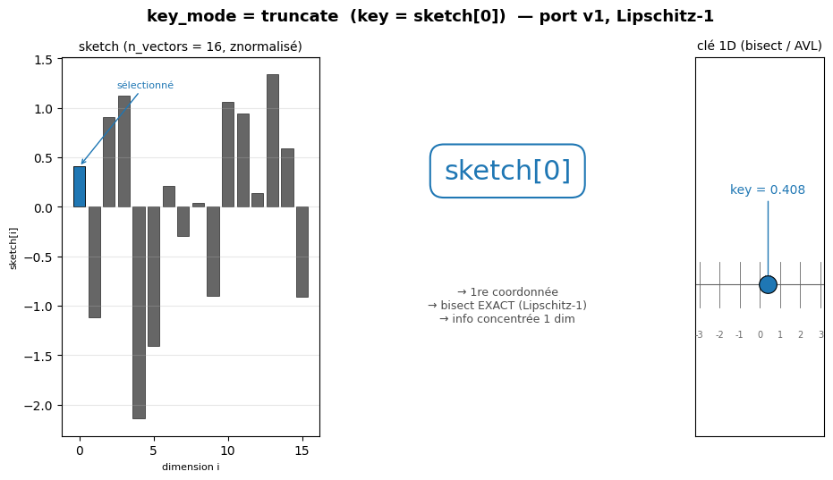
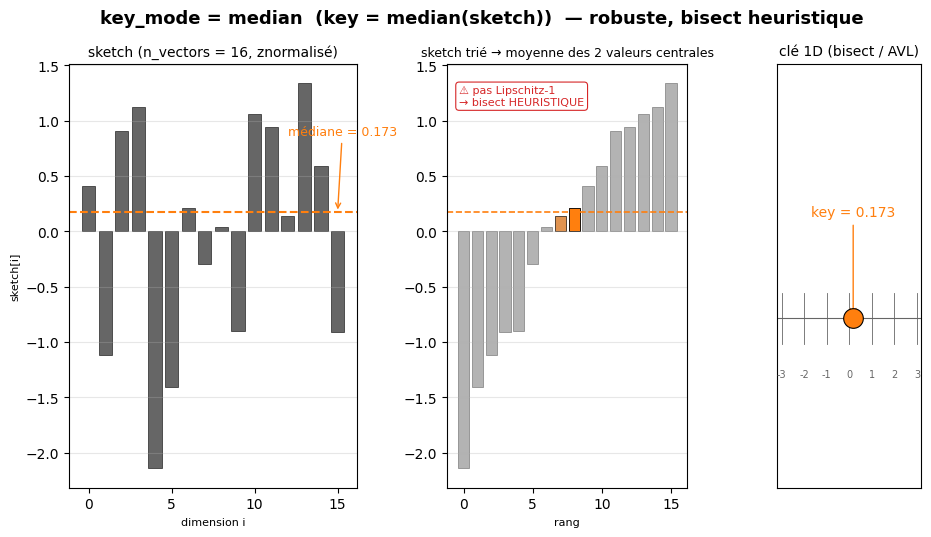
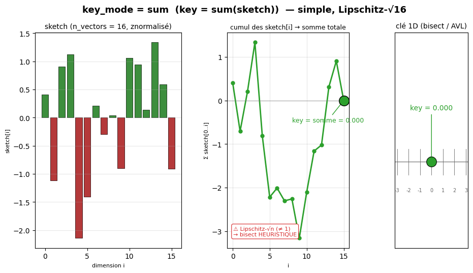
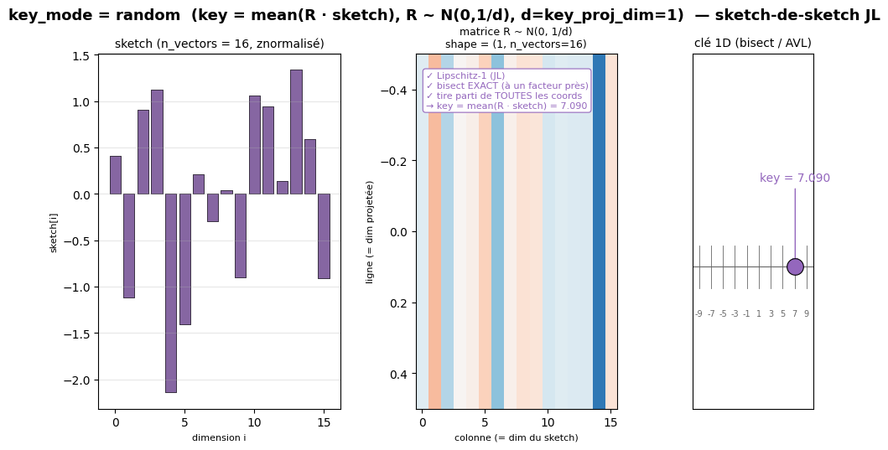

# CorrTrack v2

A **modular, deliberately simple** rewrite of the sliding-window time-series
correlation detector.

Principles:
- **self-contained** — no import from v1;
- **pandas / numpy** data structures;
- the hot numeric path goes through a **pluggable backend**, **selectable per
  phase** (sketch / candidates / validation): `python` (default), `vectorized`
  (numpy), `parallel` (processes), `cython` (compiled kernels), `mps` (Apple
  Silicon GPU), `coreml` (Apple Neural Engine, experimental), `cuda` (stub), plus
  the composites `vectorized_parallel` / `cython_parallel`;
- the sketch **method** is interchangeable (5 options): `random_projection`
  (default, v1 port), `fft_lowpass`, `fft_topk`, `median_blocks`, `median_phase`
  — see `SKETCHES.md` for the deep-dive (with figures);
- the sketch **index** structures are interchangeable (13 options): `grid`,
  `tree`, `kdtree`, `quadtree`, `bptree`, `bst`, `octree`, `knn`, `bptree3d`,
  `bst3d`, `hnsw`, `vptree`, `annoy` — see `INDEXES.md` for the deep-dive (with
  figures);
- top-level launchers: `corrtrack`, `bf`, `pipeline`; secondary launchers under
  `utils/`: `bench`, `optimize`, `compare`, `watch` (live viewer), `report`
  (auto-generated PDF) — all sharing the same functions.

---

## Layout

```
v2/
├── corrtrack.py            # launcher: CorrTrack mode
├── bf.py                   # launcher: brute-force mode (ground truth)
├── pipeline.py             # launcher: JSON-configured chained runs + comparison
├── INDEXES.md              # deep-dive on the 13 indexes (+ matplotlib figures)
├── SKETCHES.md             # deep-dive on the 5 sketch methods (RP + FFT + medians)
├── fillcorr.md             # documentation of the alternative FilCorr module
├── figures/                # PNG illustrations
│   ├── indexes/            #   1 figure per index (grid/tree/.../annoy)
│   ├── sketches/           #   1 figure per sketch_method (rp/fft_*/median_*)
│   └── keys/               #   1 figure per key_mode (truncate/median/sum/abs_sum/random)
├── utils/                  # secondary launchers
│   ├── bench.py            #   benchmark bf-vs-corrtrack + parameter sweep
│   ├── optimize.py         #   hyperparameter search (v1 optimizer port)
│   ├── compare.py          #   compare two 'correlated pairs' CSVs (v1 vs v2)
│   ├── compare_pipeline.py #   compare a v1 result folder to a v2 pipeline (metrics side by side)
│   ├── freeze.py           #   bake a pipeline's optim picks into a static '-best' config
│   ├── illustrate.py       #   matplotlib image of the candidate step (grid/tree + edges)
│   ├── watch.py            #   live viewer (table + grid views, parses run.log for ETA)
│   └── report.py           #   PDF + PNG report from comparison.csv (auto-called by pipeline)
├── core/                   # core: config, CLI, orchestration, measurements
│   ├── config.py           #   parameters (args > ENV CORRTRACK_* > defaults)
│   ├── cli.py              #   shared CLI + benchmark/sweep parser + run-dir naming
│   ├── pipeline.py         #   step orchestration (run a mode up to a step)
│   ├── profiling.py        #   per-phase timing (--profile)
│   ├── log.py              #   logging (steps, checkpoints, ETA, throughput)
│   ├── metrics.py          #   precision/recall/f1… vs a reference
│   ├── benchmark.py        #   ~70-column stats row + sweep
│   └── optimize.py         #   best-config selection (faithful v1 port)
├── steps/                  # one pipeline step per file (pure functions)
│   ├── io.py               #   1. read CSV (numeric time OR ASOS date+time) + filtering
│   ├── windows.py          #   2. split into sliding sub-windows
│   ├── sketch.py           #   3a. sketch dispatcher (random_projection + FFT + median)
│   ├── sketch_fft.py       #   3b. sketches |FFT| lowpass / topk (lag-invariant)
│   ├── sketch_median.py    #   3c. median sketches (blocks + phase)
│   ├── selection.py        #   4. select / enumerate / validate_sketches (cosine)
│   ├── validation.py       #   5. exact validation (batched Pearson, signed lag)
│   ├── monitoring.py       #   6. persistence monitoring (episodes + anomalies)
│   ├── persistence.py      #   7. write results to CSV (--output)
│   └── index/              #   sketch index (interchangeable)
│       ├── grid.py / multigrid.py   #   multi-grid vote
│       ├── tree.py         #   linear radius scan (reference)
│       ├── kdtree.py       #   generic n-dim tree (pruned radius query)
│       ├── quadtree.py     #   2D tree (random JL projection sketch→2D)
│       ├── octree.py       #   3D tree (8 octants, random JL projection sketch→3D)
│       ├── bptree.py       #   1D-sorted list + bisect (v1 BalancedIndex port; = kdtree set, faster)
│       ├── bst.py          #   real binary tree (AVL, 1D key = sketch[0])
│       ├── knn.py          #   k Nearest Neighbors (argpartition, no radius)
│       ├── bptree3d.py     #   bptree 3D variant (sketch-of-sketch JL)
│       ├── bst3d.py        #   bst 3D variant (sketch-of-sketch JL)
│       ├── hnsw.py         #   Hierarchical Navigable Small World (ANN reference)
│       ├── vptree.py       #   vantage-point tree (metric, dim-agnostic)
│       ├── annoy.py        #   Random Projection Forest (Spotify-style)
│       ├── _keyfn.py       #   1D key/proj helpers (truncate/median/sum/abs_sum/random)
│       └── _projection.py  #   random projection helper (sketch-of-sketch, JL)
└── backends/               # COMPUTE SWAP POINT (per phase)
    ├── python.py / vectorized.py / parallel.py
    ├── cython.py + _cython_kernels.pyx
    ├── mps.py              #   Apple Silicon GPU via PyTorch (numpy fallback)
    └── cuda.py             #   stub
```

---

## Pipeline

```
read csv                       steps/io.read_csv
└─ chunk into sub-windows       steps/windows.iter_windows
   ├─ sketch                    steps/sketch.make_sketcher        (→ sketch backend)
   │  └─ grid|tree|kdtree|...    steps/index/*                    (interchangeable)
   ├─ select sketches           steps/selection.select_candidates
   │  └─ validate sketches      steps/selection.validate_sketches (→ candidate backend, cosine)
   ├─ validation                steps/validation.validate         (→ validate backend, Pearson)
   ├─ monitoring                steps/monitoring.Monitor           (persistence + anomalies)
   └─ write CSV (--output)       steps/persistence.save_results
```

- **bf** mode replaces `sketch → index → select` with
  `selection.enumerate_candidates` (all pairs), then reuses the **exact same
  validation and monitoring** → it is the ground truth.
- **monitoring** tracks, window after window, the lifetime of each correlated
  relation `(id1, id2, lag)` and emits anomalies: `in`, `out`, `sign_flip`.

---

## Usage

### Running from any directory

The launchers are invoked as **modules** (`-m v2.<…>`), so the **parent of
`v2/`** (the repo root) must be on the Python path:

```bash
# (a) from the repo root: works directly
python3 -m v2.bf data.csv

# (b) from anywhere: point PYTHONPATH at the repo root
PYTHONPATH=/path/to/CorrTrack python3 -m v2.bf /path/to/data.csv

# (c) once and for all: add to ~/.zshrc, then open a new terminal
export PYTHONPATH=/path/to/CorrTrack:$PYTHONPATH
```

> Running the file directly (`python3 v2/bf.py`) **fails**: relative imports
> require `-m v2.<launcher>`. The CSV path may be relative or absolute.

### Input formats

Auto-detected from the first column:
- **numeric time**: `time, s0, s1, …` (first column = time, then series);
- **ASOS date+time**: `date, time, s0, s1, …` (first column non-numeric →
  `date`+`time(hour)` merged into a datetime; the time axis becomes an integer
  hour count, series start at **column 2** — see `datasets/asos_loader.py`).

### Examples

```bash
python3 -m v2.corrtrack data.csv
python3 -m v2.bf        data.csv

# run only up to a step (inclusive) and inspect its result
python3 -m v2.corrtrack data.csv --step sketch
python3 -m v2.bf        data.csv --step candidates

# index structure (generic n-dim tree, or 2D quadtree)
python3 -m v2.corrtrack data.csv --index-backend kdtree --query-radius 2.0

# data filtering at read time: first N series, last N years
python3 -m v2.corrtrack data.csv --n-series 5 --n-years 6
python3 -m v2.bf        data.csv --n-series 3 --n-years 1000 --obs-mode count

# negative correlations + write results to disk
python3 -m v2.bf data.csv --neg-corr --output ./out

# bottleneck profiling + progress logs
python3 -m v2.corrtrack data.csv --profile
python3 -m v2.bf        data.csv --log-file run.log --log-every 10

# parameters via environment variables (CORRTRACK_ prefix)
CORRTRACK_WINDOW_SIZE=48 CORRTRACK_CORR_THRESHOLD=0.8 python3 -m v2.corrtrack data.csv
```

### Output

By default everything goes to `--output` (default `results/`). `corrtrack`/`bf`
nest each run in a **sub-folder named after the modified parameters** (those that
differ from the defaults): `results/<mode>_<short params>/`. Example:
`v2.bf data.csv --n-series 5 --n-years 1 --backend vectorized` →
`results/bf_ns-5_ny-1_back-vect/`. It contains:
- `correlated.csv` (`id1,t1,id2,t2,lag,corr`), and — at `--step monitor` —
  `episodes.csv`, `anomalies.csv`;
- `summary.csv` (**parameters used** as `param.*` + counters + runtime + per-phase
  timings — a self-describing record of the run);
- `run.log` (the log).

The console prints only a **compact summary**; large result lists are never
dumped to stdout. `--output ""` disables writing. `--clean` deletes the output
sub-folder at startup (clean run). (`bench`/`optimize` write their `stats.csv`
directly under `--output`, without a sub-folder.)

### Logs

At startup a **parameter synthesis** is logged (`params | …`). During streaming a
**checkpoint** is emitted every `--log-every` seconds (default 5) with the
**backend** (`back=…`), the **throughput** (`win/s`, `cand/s`), the per-phase
(v1) time both **cumulative** (`cum:`) and over the **interval** (`Δ:`), and an
**ETA** (from the recent rate). At the end, the per-phase timing breakdown is
logged (fine v2 sub-steps shown at `--log-level debug`). Console → stderr;
`--log-file` also writes a `.log`.

Steps (`--step`, default `all` = up to `monitor`):
- **corrtrack**: `read, windows, sketch, index, select, validate_sketches, validate, monitor`
- **bf**: `read, windows, candidates, validate, monitor`

---

## Compute backends (per phase)

A backend can be set **globally** or **per phase** (sketch / candidates /
validation):

```bash
python3 -m v2.corrtrack data.csv --backend vectorized          # all 3 phases
python3 -m v2.corrtrack data.csv --backend parallel --max-workers 8
python3 -m v2.corrtrack data.csv --backend cython              # pip install cython
python3 -m v2.corrtrack data.csv --backend mps                 # pip install torch
python3 -m v2.corrtrack data.csv --sketch-backend vectorized \
        --candidate-backend cython --validate-backend cython_parallel
```

| Backend | Kernel | Parallel | Notes |
|---|---|---|---|
| `python` | explicit loops | no | reference, default |
| `vectorized` | numpy batched | no | `correlate` stacks all pairs |
| `parallel` | python | yes (`ProcessPool`) | python kernel across N processes |
| `vectorized_parallel` | numpy batched | yes | numpy batched across N processes |
| `cython` | compiled kernels | no | pure-Python fallback if Cython absent; ~10× on `validate` |
| `cython_parallel` | compiled kernels | yes | cython across N processes |
| `mps` | Apple Silicon GPU (PyTorch) | — | numpy fallback if torch/mps absent |
| `coreml` | Apple Neural Engine via CoreML | — | **experimental**, float16, self-validated vs numpy + numpy fallback; needs `coremltools` (CoreML decides ANE placement, not guaranteed) |
| `cuda` | — | — | stub (`NotImplementedError`) |
| `sharded_vectorized` / `sharded_cython` / `sharded_mps` | base kernel | yes (`ThreadPool`) | **sketch + index.insert** thread-parallel over `max_workers` shards, barrier before `select`. See `INDEXES.md` § sharded. |

> `vectorized` and `cython` are **alternative kernels** (not combined);
> parallelism is orthogonal (`*_parallel`, persistent pool, only above a minimum
> batch size). To mix techniques per phase, use `--sketch/candidate/validate-backend`.
>
> `sharded_*` is a **different parallelism dimension**: a shared thread-pool on
> the sketch+insert phase (whereas `*_parallel` parallelizes `validate` across
> processes). They combine: `backend=sharded_vectorized` +
> `validate_backend=vectorized_parallel` → end-to-end.

---

## Sketch index (corrtrack mode)

| `--index-backend` | Structure | Property |
|---|---|---|
| `grid` (default) | multi-grid vote | `grid_n_tables` shifted grids, low `grid_n_coords` → recall; threshold `grid_vote_min` |
| `tree` | linear radius scan | simple reference, O(n) per query |
| `kdtree` | generic n-dim tree | pruned radius query; **identical results** to `tree` |
| `quadtree` | 2D tree | random **JL projection** sketch→2D (sketch-of-sketch); wider recall, precision kept by validation |
| `octree` | 3D tree (8 octants) | random **JL projection** sketch→3D; tighter than quadtree, looser than kdtree |
| `bptree` | 1D-sorted (bisect) | port of v1's `BalancedIndex`: bisect on `sketch[0]` ±`query_radius` + full-Euclidean refine; **same candidate set as `kdtree`, faster** via the 1D pre-filter |
| `bst` | **real binary tree** (AVL) | same candidate set as `bptree`/`kdtree`; AVL guarantees O(log N) on insertion/removal too |
| `knn` | k Nearest Neighbors | `argpartition` O(N); **fixed `n_neighbors` candidates** (no radius) — predictable cost |
| `bptree3d` / `bst3d` | 3D variants of `bptree` / `bst` | sketch projected to 3D via JL random projection (= `octree` candidate set, different impl) |
| `hnsw` | hierarchical small-world graph | **ANN state-of-the-art** (FAISS-like); `hnsw_ef_s` knob tunes recall vs speed |
| `vptree` | vantage-point tree | metric split (distance to pivot), **dimension-agnostic** (no curse of dim) |
| `annoy` | random-projection forest | `annoy_n_trees` independent trees (Spotify-style), union of leaves → candidates |

**Recall tuning (multi-grid vote):** `grid` uses `grid_n_tables` grids, each over only
`grid_n_coords` sketch coordinates (low dimension = frequent collisions), with
random shifts. A pair is a candidate if it co-occurs in `grid_vote_min` grids.
Pearson validation guarantees precision; the vote only drives recall. In
practice, **many grids + low `grid_n_coords`** maximize recall.

---

## Benchmark / stats (`v2.utils.bench`)

`python -m v2.utils.bench` runs **both modes** on the same CSV and emits one stats row
per config (~70 columns, `;`-separated, identical to the v1 harness format):

```bash
python3 -m v2.utils.bench data.csv --dataset-id fr_air_5_6 --stats-output stats.csv
# sweep: every flag accepts a comma list → cartesian product; bf computed once
# per group of bf-affecting parameters.
python3 -m v2.utils.bench data.csv --grid-cell 0.25,0.5,1.0 --grid-n-coords 1,2
```

Columns: per-phase timings (bf and corrtrack), `speedup`/`speedup_ceil`/
`rel_speedup_eff`, counts (`cand_w(_bf)`, `tested_w(_bf)`, `corr_w(_bf)`,
`corr_prop`, `waste_val(_bf)`, `rel_waste_red`), and quality vs brute-force
(`precision/recall/f1` + `_pos`/`_neg` by correlation sign, `specificity`,
`recall_min`). `aucroc`/`pr_auc` are `nan` (as in the v1 streaming path).

---

## Hyperparameter search (`v2.utils.optimize`)

`python -m v2.utils.optimize` sweeps a parameter grid on the **first `--train-ratio`**
fraction of observations, then **selects the best config** (faithful v1 port):
keep successful → feasible (`speedup>1` and `grid_vote_min<1`, else all) →
`recall ≥ target_recall` (else fall back to within `recall_fallback_near_ratio`
of the best recall) → keep speedup within `speedup_near_ratio` of the best →
tie-break by fewest candidates then highest speedup.

```bash
python3 -m v2.utils.optimize data.csv \
    --n-vectors 8,16,32,64 --grid-cell 0.25,0.5,0.75,1,1.25 --grid-n-coords 1 \
    --train-ratio 0.3333 --target-recall 0.95 --output results
```

Writes (in `--output`): `stats.csv` (all configs) and `best_params.json` (chosen
config + its recall/speedup/cand_w).

---

## Pipeline: chain executions (`v2.pipeline`)

`python -m v2.pipeline config.json` chains a list of executions described in
JSON, nests each into `results/<pipeline name>/<run name>/`, then writes
`comparison.csv` (benchmark ~70-column format) measuring **speedup**, number of
**correlations** and quality of each run against a **baseline** run (used as the
reference, in the brute-force role).

Top-level `params` are **shared by every run**; each run's `params` only lists
its **differences** (so you don't repeat `n_series`/`n_years` everywhere).

**Baseline (reference for speedup/recall).** The baseline is the **slowest
brute-force run present** — bf runs are ranked by backend slowness
(`python > parallel > cython > vectorized > mps/coreml/cuda`; ties → first), and
the winner is moved to position 0 (required for the incremental, memory-bounded
comparison). If **no bf run is present**, `bf_python` is **auto-added** in front
as the reference. Opt out with **`"baseline": false`** — then no bf is added and
all speedup/recall become **relative to run #0** (a red ⚠️ warning is printed at
the end as a reminder). Use this when the full brute-force is too slow and you
only want to compare corrtrack configs against each other.

**Built-in optimization (per run).** A top-level `"optimize"` block holds the
**central settings** (the grid + selection knobs). A corrtrack run opts in with
**`"optimize": true`** → it runs **its own sweep** (over the central grid, with
its own params fixed) on a **small subset** (`train_ratio`, default `0.1`),
selects the best config (**precision ≥ `target_precision`** [0 = off], then
**recall ≥ `target_recall`**, then near-best speedup, then fewest candidates —
the v1 rule), and runs full with those params. Each optimized run
writes `optimize_stats.csv` + `best_params.json` in a dedicated
`<run>/optimize/` folder, and its sweep wall-time is reported as **`opt_time`**.
A run without `optimize` uses its **static** `params`. The sweep is **logged**
(`[INFO] --- OPTIMIZE <run> ---` banner + each config's recall/speedup/corr%,
winner marked) to the console and `<run>/optimize/optimize.log`. `optimize` is
**ignored for `bf`** runs (grid params don't affect brute-force) with a warning.
With `incremental: true`, a cached run is reused and its optimization is **not**
re-run (set `"rerun": true` on it to force).

**Optimize does NOT need a pipeline bf.** The sweep computes its **own** bf per
parameter-group on the `train_ratio` subset (its ground truth) — fast. The
pipeline-level bf (slow, full dataset) is only the reference for the final
speedup/recall columns. So `"optimize": true` works fine with `"baseline":
false` (no slow bf at all); the final speedup/recall are just relative to run #0.
The swept configs **never persist** (their output is disabled) — only the final
run writes to `results/<name>/<run>/`, so the sweep can't pollute `results/`.

**Boosting recall.** `target_recall` does **not force** recall — the optimizer
picks the best config in the grid and **falls back** to the best available if
none reaches the target (it logs a WARNING naming the missing lever). The recall
levers **depend on the index**, so put the right ones in the grid:
- `grid` / `quadtree`: **`grid_n_coords: [1]`** (low dim → far more collisions),
  bigger `grid_cell` (≤1.25), more `grid_n_tables` (16/32);
- `kdtree` / `tree`: **`query_radius`** (e.g. [2,4,8]) — `grid_cell`/`grid_n_coords`/
  `grid_n_tables` do **not** affect these.

Plus a lower `sketch_threshold` helps. Higher recall = more candidates = less
speedup; the tradeoff shows in the exposed sweep.

```
"optimize": {
  "grid": {"n_vectors": [16,32,64], "grid_cell": [0.25,0.5], "sketch_threshold": [0.7,0.8]},
  "train_ratio": 0.1,
  "target_recall": 0.9,
  "target_precision": 0.0,
  "backend": "vectorized",        // per-config compute backend for swept runs
  "workers": 4,                   // parallel sweep (ProcessPool); >1 to enable
  "auto_derive": true,            // fix invariant axes (grid_n_coords=1, sketch_threshold=0.7,
                                  // grid_vote_min=1) + clip query_radius to LSH theory max
  "smart_grid": true,             // sweep only the axes RELEVANT for each run's index
                                  // (kdtree/tree/bptree/bst/octree: query_radius only;
                                  // grid: grid_cell/grid_n_tables/grid_vote_min/grid_n_coords only;
                                  // implied by auto_derive)
  "successive_halving": 3         // multi-budget sweep: stage 1 = all configs @ train_ratio/4,
                                  // top 50% → stage 2 @ train_ratio/2, top 50% → stage 3 @ full.
                                  // ~25–50% time saved vs flat sweep. true = 3 stages, or pass n.
},
"runs": [
  {"name": "bf",         "mode": "bf"},
  {"name": "ct_static",  "mode": "corrtrack", "params": {"n_vectors": 16}},
  {"name": "ct_opt",     "mode": "corrtrack", "optimize": true, "params": {"backend": "vectorized"}}
]
```

Precedence during a run's optimization: **shared `params` (swept if in the grid)
< grid (optimized) < the run's explicit `params` (STATIC — fixed even if listed
in the grid)**. So a parameter is "static if the run sets it, else optimized if
in the grid". The grid may also include **execution params** (`backend`,
`max_workers`, `cores`): recall is identical across them, so the selection picks
the fastest — but optimizing those on a *small* subset is misleading (parallel/
mps overhead only pays off at scale), so raise `train_ratio` for that.

`comparison.csv` adds, after the ~70 standard columns: `opt_time`, per-phase
speedups (`cand_speedup`, `val_speedup`, `monit_speedup` = baseline phase time /
run phase time), `cand_w_pct` / `corr_w_pct` (= run cand_w/corr_w as a % of the
baseline's), and `missed` (# baseline correlations the run did not find). The
console table shows `opt_t`, `opt_n` (# configs swept during optim), per-phase
times, `cand%`/`corr%`, `tested_w` (pairs after cosine pre-filter), `missed`,
recall/prec/spec. After the table, a **"parameters used per run"** block lists
each run's params (index/n_vectors/grid_dim/grid_cell/grid_n_tables/sketch_thr/backend)
— for optimized runs these are the **optim-selected** values. Each run also gets a **`missed.csv`** in its folder — the
**correlations the baseline found but this run missed** (false negatives),
sorted by `|corr|` (strongest misses first) — to diagnose what the index drops.

To **re-run only the analysis** (rebuild comparison.csv + the table without
recomputing the runs), set `"incremental": true` + `"clean": false` and re-run
the pipeline — cached runs are reloaded and the comparison is regenerated.

**Memory (dense datasets).** A run only **retains** the candidate/prevalidated
lists when the target actually returns them (`select`/`candidates`/
`validate_sketches`); otherwise it keeps just a **count**. This matters for
brute-force on dense data (e.g. 25 series × 10 years → hundreds of millions of
candidate pairs per the cumulative `cand=` counter): keeping the full list would
OOM a 32 GB node, while only the count is ever needed for `n_candidates`. What
still grows in RAM is `correlated` (the actual output, saved at the end).

**Incremental testing.** Set top-level `"incremental": true` (and keep
`"clean": false`) to **reuse already-computed runs** from disk and only execute
the new/changed ones — handy to add backends/configs over several invocations
without redoing expensive runs. Per run, `"rerun": false` reuses its cached
result (loaded from `result.json` + `correlated.csv`); `"rerun": true` forces
re-execution. If a cached result is missing, the run executes anyway.

```json
{
  "name": "bf_backends",
  "dataset": "fr-air_temperature.csv",
  "baseline": 0,
  "clean": true,
  "params": {"n_series": 3, "n_years": 1},
  "runs": [
    {"name": "python",              "mode": "bf"},
    {"name": "vectorized",          "mode": "bf", "params": {"backend": "vectorized"}},
    {"name": "parallel",            "mode": "bf", "params": {"backend": "parallel"}},
    {"name": "vectorized_parallel", "mode": "bf", "params": {"backend": "vectorized_parallel"}}
  ]
}
```

```bash
python3 -m v2.pipeline --init [path]        # write a template JSON (default ./pipeline.json)
python3 -m v2.pipeline config.json          # or --dataset to override the CSV
```

The JSON tolerates **comments** (`//` and `/* */`) and **trailing commas**, so
you can comment out a run or a parameter (e.g. `// "backend": "mps",`). For the
baseline (index, default 0): `speedup = runtime_baseline / runtime_run`,
`corr_w_bf` = baseline correlations, `precision/recall` = run vs baseline.

### Generate a pipeline JSON (`v2.utils.gen_pipeline`)

Builds the cartesian product **sketches × indexes × backends × workers × key-modes**:

```bash
python3 -m v2.utils.gen_pipeline --output pipe.json \
    --indexes bptree,kdtree,grid --backends vectorized,sharded_vectorized \
    --sketches random_projection,fft_lowpass --key-modes truncate,median \
    --workers 4 --n-series 5 --n-years 1
```

Rules baked in: `bf_python` baseline added in front (unless `--no-baseline`,
which also sets `"baseline": false` so the pipeline does **not** re-inject it);
`workers` applies only to `sharded_*` backends; `knn` → `n_neighbors=512`;
`median_*` sketches → `n_vectors=24`; key-modes declined only for
`bptree`/`bst`/`bptree3d`/`bst3d`. The default optimize grid sweeps
`n_vectors`/`grid_cell`/`grid_n_tables`/`query_radius`/`n_neighbors` — **not**
`key_mode`/`key_proj_dim` (those are pinned per-run, so static, and irrelevant
for the other indexes). `--no-optimize` omits the `optimize` block **and** the
per-run `"optimize": true`. `optimize` + `--no-baseline` is **valid** (the sweep
uses its own train-subset bf).

---

## Freeze optimization into a static config (`v2.utils.freeze`)

**The pipeline does this automatically**: after any run with per-run optimization,
it writes `<config>-best.json` (optim picks baked as static `params`, `optimize`
dropped, `-best` suffix on the name + optimized run names) and prints
`[pipeline] frozen best-params config -> …`. Re-run that file to reproduce the
tuned results instantly (no sweeping).

You can also run it standalone to (re)generate it from existing results:

```bash
python3 -m v2.utils.freeze pipeline-run.json            # -> pipeline-run-best.json
python3 -m v2.utils.freeze pipeline-run.json --out tuned.json --suffix -best
```

For each run with `"optimize": true`, it reads `<run>/optimize/best_params.json`,
merges those params as **static** `params`, drops the `optimize` flag, and appends
the suffix (default `-best`) to the run name; the pipeline `name` also gets the
suffix (so it writes to its own results dir). Runs without optimization are kept
as-is. Re-run the `-best` config to reproduce the tuned results instantly.

## Illustrate steps (`v2.utils.illustrate`)

Renders a matplotlib **JPG** of a pipeline step for one window:
- `sketch` (corrtrack) — the series' sketches (first 2 coords) as points;
- `candidates` — the candidate pairs as edges (+ **grid cells** for `grid`,
  **neighborhood-radius** circles for `tree`/`kdtree`/`quadtree`);
- `validate` — the correlated pairs as edges (green = +corr, red = −corr).

Corrtrack uses the 2D sketch scatter; **brute-force** has no sketch, so series
are laid out on a **circle** (graph view). Intermediate CSVs are written so the
image can be regenerated.

```bash
python3 -m v2.utils.illustrate data.csv --ill-step candidates --index-backend grid \
    --n-series 8 --window-size 24 --window 5 --image cand.jpg
python3 -m v2.utils.illustrate data.csv --ill-step validate --mode bf --image bf_val.jpg
```

In the **pipeline**, a run says which steps to render per window:
`"illustrate": {"sketch": true, "candidates": true, "validate": true, "windows": [0,5]}`
→ images go to `results/<pipeline>/<run>/illustrate/<step>_w<N>.jpg`.

## Live watch (`v2.utils.watch`)

`python -m v2.utils.watch config.json` refreshes a pipeline's summary table
every 3 seconds (configurable) **while it is running** — same format as the
final output, plus a ✓/⏳/· status icon and the live progress of every running
run (extracted from the `CP: N/M ... ETA` checkpoints of `run.log`).

```bash
cd /path/to/your/test/  # same cwd as the pipeline (results are relative)
python3 -m v2.utils.watch config.json                # synth view (default)
python3 -m v2.utils.watch config.json --view grid    # 1 cell per run
python3 -m v2.utils.watch config.json --view table   # 1 row per run
python3 -m v2.utils.watch config.json --interval 5   # refresh every 5s
python3 -m v2.utils.watch config.json --once         # single snapshot
```

* **Synth view (default)** — optimized for 100s/1000s of runs: a
  `backend × sketch_method` heatmap matrix (cell = mini-bar + `done/total`), the
  list of running runs (with mini-bar + ETA), top 10 by recall × speedup, and
  global stats (recall / speedup / runtime mean-min-max).
* **Grid view**: 2-line cells (`name` + `r=… spd=… ⏱ t`) grouped by
  `(backend, sketch_method)` with a header and a per-section counter; columns
  auto-fit to the terminal width.
* **Table view**: 1 row per run with every metric (same as the end of the
  pipeline).
* Uses the **alternate screen buffer** (like `htop`/`less`) → no scrollback
  pollution; Ctrl-C restores the terminal to its previous state.

## Compare v1 / v2 results (`v2.utils.compare`)

`python -m v2.utils.compare A.csv B.csv` compares two 'correlated pairs' CSVs
(typically v1 vs v2 output). It auto-detects the layout (v1
`id1,id2,time1,time2,corr` vs v2 `id1,t1,id2,t2,lag,corr`), keys each pair
order-independently as `{(id,t),(id,t)}`, and reports matched / only-in-A
(missed) / only-in-B (extra), precision/recall/f1 (A = ground truth), sign
agreement, `max |Δcorr|`, and a verdict `IDENTICAL` / `DIFFERENT`
(`--examples N`, `--tol`). Both files must come from the same dataset and
parameters.

## Parameters

Resolution: **CLI argument > environment variable (`CORRTRACK_*`) > default.**
In `bench`/`optimize`, **every** flag below also accepts a comma list `a,b,c`
(sweep); booleans there take an explicit value (`--clean true`), whereas in
`corrtrack`/`bf` `--clean` is a plain flag.

### Common (all modes)

| Parameter | CLI flag | Type | Default | Description |
|---|---|---|---|---|
| `n_series` | `--n-series` | `int` | `0` | keep only the first N series (0 = all) |
| `n_years` | `--n-years` | `int` | `0` | keep only N years / rows of observations (0 = all) |
| `obs_mode` | `--obs-mode` | `{years,count}` | `years` | `years`: last N×365×24 obs; `count`: first N rows |
| `window_size` | `--window-size` | `int` | `168` | sub-window length (1 week in hours, v1) |
| `window_step` | `--window-step` | `int` | `12` | shift between consecutive windows |
| `n_lags` | `--n-lags` | `int` | `16800` | max time gap to pair two windows (`7×24×100`, v1) |
| `corr_threshold` | `--corr-threshold` | `float` | `0.8` | min Pearson correlation (exact validation, v1) |
| `neg_corr` | `--neg-corr` / `--no-neg-corr` | `bool` | `True` | also accept `\|corr\| ≥ threshold` (v1) |
| `std_threshold` | `--std-threshold` | `float` | `0.0` | skip near-constant windows (std < this); v1 ≈ `0.001`; 0 = off |
| `backend` | `--backend` | backend¹ | `python` | compute backend shared by the 3 phases |
| `cores` | `--cores` | `{auto,perf,eco}` | `auto` | macOS core hint (QoS): `perf`=P-cores, `eco`=E-cores |
| `validate_backend` | `--validate-backend` | backend¹ | `""` | backend for the validation phase (empty = `backend`) |
| `max_workers` | `--max-workers` | `int` | `0` | number of processes (parallel backends; 0 = auto) |
| `output` | `--output` | `str` | `results` | output directory (CSVs + logs); empty = no writing |
| `clean` | `--clean` / `--no-clean` | `bool` | `False` | delete the output directory at startup |
| `profile` | `--profile` | `bool` | `False` | print the per-phase timing table |
| `log_level` | `--log-level` | `{debug,info,warning,error}` | `info` | log verbosity |
| `log_file` | `--log-file` | `str` | `""` | also write logs to this `.log`; empty = `<output>/run.log` |
| `log_every` | `--log-every` | `float` | `5.0` | seconds between progress checkpoints |

¹ backend ∈ `{python, vectorized, parallel, vectorized_parallel, cython, cython_parallel, mps, coreml, cuda}`.

### CorrTrack only (sketch + candidate index — unused by `bf`)

| Parameter | CLI flag | Type | Default | Description |
|---|---|---|---|---|
| `n_vectors` | `--n-vectors` | `int` | `16` | sketch dimension (number of random projections) |
| `seed` | `--seed` | `int` | `2468` | random-projection seed |
| `basic_window` | `--basic-window` | `int` | `0` | `>0`: incremental sketch (must divide `window_size`) |
| `index_backend` | `--index-backend` | `{grid,tree,kdtree,quadtree,bptree,bst,octree,knn,bptree3d,bst3d,hnsw,vptree,annoy}` | `grid` | sketch index structure (13 options, see `INDEXES.md`) |
| `n_neighbors` | `--n-neighbors` | `int` | `32` | k for `knn` (number of returned neighbors, fixed) |
| `key_mode` | `--key-mode` | `{truncate,median,sum,random}` | `truncate` | index key extraction for `bptree`/`bst` (1D) and `bptree3d`/`bst3d` (3D) — see "Key extraction" below |
| `key_proj_dim` | `--key-proj-dim` | `int` | `1` | projection dimension in `key_mode=random` (1D only; `bptree3d`/`bst3d` always pin it to 3) |
| `hnsw_m` | `--hnsw-m` | `int` | `16` | HNSW: max connections per layer > 0 (2·M at layer 0) |
| `hnsw_ef_c` | `--hnsw-ef-c` | `int` | `200` | HNSW: ef size during construction |
| `hnsw_ef_s` | `--hnsw-ef-s` | `int` | `50` | HNSW: ef size during search (recall ↔ speed knob) |
| `annoy_leaf_size` | `--annoy-leaf-size` | `int` | `32` | Annoy: max leaf size before linear scan |
| `grid_cell` | `--grid-cell` | `float` | `0.5` | grid cell size |
| `grid_n_tables` | `--grid-n-tables` | `int` | `8` | grid LSH: number of hash tables (multi-grid vote) |
| `grid_n_coords` | `--grid-n-coords` | `int` | `2` | grid LSH: number of indexed sketch coords |
| `quadtree_proj_dim` | `--quadtree-proj-dim` | `int` | `2` | quadtree: JL projection dimension |
| `annoy_n_trees` | `--annoy-n-trees` | `int` | `8` | annoy: number of independent trees |
| `grid_vote_min` | `--grid-vote-min` | `int` | `1` | min number of co-occurring grids |
| `query_radius` | `--query-radius` | `float` | `0.5` | neighborhood radius (`tree`/`kdtree`/`quadtree`) |
| `sketch_threshold` | `--sketch-threshold` | `float` | `0.7` | min cosine (sketch-level filter) |
| `sketch_backend` | `--sketch-backend` | backend¹ | `""` | backend for the sketch phase (empty = `backend`) |
| `candidate_backend` | `--candidate-backend` | backend¹ | `""` | backend for the candidate/cosine phase (empty = `backend`) |

### Key extraction (`--key-mode`)

The 1D indexes **`bptree` / `bst`** (and their 3D variants `bptree3d` /
`bst3d`) index the sketches through a **scalar key** (or a triplet in 3D)
derived from the `n_vectors`-D sketch. `key_mode` picks the formula.

|  |  |  |  |
|:-:|:-:|:-:|:-:|
| `truncate` | `median` | `sum` | `random` |

| `key_mode` | Formula (1D, `bptree`/`bst`) | Lipschitz-1? | Behaviour |
|---|---|---|---|
| `truncate` (default) | `key = sketch[0]` | **✓** | the v1 convention; EXACT bisect (zero false negatives), but the information is concentrated on a single coord |
| `median` | `key = median(sketch)` | ✗ | robust to sketch outliers; **heuristic bisect** → may miss valid neighbours if `query_radius` is too tight |
| `sum` | `key = sum(sketch)` | ✗ (Lipschitz-√n) | very simple; sensitive to an additive shift; **heuristic bisect** |
| `random` | `key = mean(R @ sketch)` with `R ∈ ℝ^(d × n_vectors) ~ N(0, 1/d)` | **✓** (unit norm.) | 1D sketch-of-sketch; average of `d = key_proj_dim` JL projections; EXACT bisect up to a factor |

**3D variants (`bptree3d` / `bst3d`) — projection onto 3D instead of 1D:**

| `key_mode` | Formula (3D, `bptree3d`/`bst3d`) |
|---|---|
| `truncate` | `key = sketch[:3]` |
| `median` | 3 medians over 3 slices of the sketch (`np.array_split` into 3) |
| `sum` | 3 sums over 3 slices |
| `random` (3D default) | JL projection `R @ sketch` with `R ∈ ℝ^(3 × n_vectors)` |

**Precision is guaranteed no matter what.** The downstream Pearson validation
(step 5 of the pipeline) ALWAYS filters the pairs: `key_mode` only affects the
recall of the index (how many correlated pairs actually become candidates).
`median` and `sum` may reduce recall — but `precision = 1.0` stays preserved.
In practice: start with `truncate` (sound), try `random` to diversify the
information carried by the key, keep `median`/`sum` for experiments.

**`key_proj_dim` (`random` mode only) — MIND THE TRAP.**
For `bptree`/`bst`, the index is **ALWAYS 1D**: the key is a **scalar** on which
bisect / AVL range is performed. In `random` mode, `d = key_proj_dim` JL
projections are computed and their **average** is taken → still a single float
(see `_keyfn.py:make_key_fn` → `return lambda v: float(np.mean(R @ v))`).
`key_proj_dim` only tunes the **statistical stability of the key** (d=1 = one
noisy projection; d>1 = a more stable average). Do not mistake it for a 3D index
— it stays a 1D index whatever `key_proj_dim` is.

For `bptree3d`/`bst3d`, the index is 3D (the projection function returns a
3-dim vector); `key_proj_dim` is **ignored** (always 3, pinned by the 3D nature
of the index).

### Optimizer only (`v2.utils.optimize`)

| Parameter | CLI flag | Type | Default | Description |
|---|---|---|---|---|
| `train_ratio` | `--train-ratio` | `float` | `1.0` | `<1`: sweep on the first `round(r×T)` observations |
| `target_recall` | `--target-recall` | `float` | `0.95` | target recall for selection |
| `target_precision` | `--target-precision` | `float` | `0.0` | min precision for selection (0 = off) |
| `recall_fallback_near_ratio` | `--recall-fallback-near-ratio` | `float` | `0.98` | fallback: recall ≥ ratio × best recall |
| `speedup_near_ratio` | `--speedup-near-ratio` | `float` | `0.98` | near-best speedup band before tie-break |

---

## Sketch methods (`--sketch-method`) — see `SKETCHES.md` for the deep-dive

| `sketch_method` | Idea | When to use it |
|---|---|---|
| `random_projection` (default) | Gaussian `N(0,1)` matrix, faithful v1 port | reasonable recall + maximum speedup (selective) |
| `fft_lowpass` | first `n_vectors` `\|FFT(window)\|` magnitudes (low-pass) | periodic or smooth signals — captures the low bands |
| `fft_topk` | the `n_vectors` largest FFT magnitudes (adaptive top-k) | signals with dominant spectral peaks; **very high recall** |

The **FFT** sketches take the **magnitude** (not the complex value) → nearly
invariant to time shifts (a shift = a phase rotation). This catches correlations
at an **unknown lag**, where `random_projection` requires relatively short lags.
In exchange they are less selective (more candidates) — the downstream Pearson
validation preserves `precision = 1.0`. Measured on a quick test (n_series=8,
window_size=48): recall 0.43 (random_projection) → 0.87 (fft_lowpass) →
**0.995** (fft_topk).

Incompatible with `--basic-window > 0` (the incremental sketch is only defined
for the random projection).

```bash
python3 -m v2.corrtrack data.csv --sketch-method fft_topk --index-backend kdtree
```

## Incremental sketch

With `--basic-window B` (B dividing `window_size`), the sketch is computed over
sub-windows of length B that are cached: when the window slides, only the new
sub-windows are projected. Cost per window: `~window_size/B` fewer projections,
result identical to a fresh recomputation. `basic_window=0` (default) = full
recompute.

---

## Extending

- **Compute backend:** subclass `Backend` (`backends/base.py`) implementing
  `project`, `znormalize`, `pearson`, `correlate`, `cosine`, `distance`; register
  it in `BACKENDS` (`backends/__init__.py`).
- **Index structure:** implement `SketchIndex` (`insert`/`query`/`remove`) under
  `steps/index/`, wire it in `make_index`, expose it in `core/cli.py`.
- **Parameter:** add a field to `Config` (`core/config.py`) — it is automatically
  ENV-resolved, CLI-sweepable in benchmark, and dumped in `summary.csv`; add the
  argument in `core/cli.py` to expose it to `corrtrack`/`bf`.
- **Step:** each step is a pure function in `steps/`; edit the chain in
  `core/pipeline.py` (`CORRTRACK_STEPS` / `BF_STEPS`).

---

## Known limitations / notes
- `index/tree.py` is the linear reference; `kdtree` is the pruned n-dim
  equivalent. `quadtree` is 2D (wider recall, precision kept by validation).
- **`bf_python` is the reference baseline** for every speedup/recall in
  `pipeline`. If a JSON forgets it, the pipeline auto-prepends it with a
  warning (`[pipeline] WARNING: 'bf_python' missing — prepended …`) and
  re-anchors `baseline=0`.
- **Colorized console output** — the pipeline summary table colorizes the
  `speedup` / `recall` / `rec_rel` / `prec` / `spec` columns (bright-green ≥
  0.95 or ≥ 5×, green > 1, yellow > 0.5/0.8, red below). Auto-disabled if
  stdout is not a TTY (logs/pipes stay clean), or if `NO_COLOR=1` is set.
- `cython` falls back to pure Python if Cython is not installed
  (`pip install cython`); `mps` falls back to numpy if PyTorch/mps is unavailable
  (`pip install torch`); `cuda` is still a stub.
- `bench`: columns with no v2 concept (`mem_w`, `nodes`, `artifact_time`,
  `grid_max`, `cell_stretch`, `seed_toggle`) are emitted empty/0; `aucroc`/
  `pr_auc` = `nan`.
- **Toolchain note:** on Python 3.14 / numpy 2.2.6 (arm64), `ndarray.sum(axis=1)`
  returned wrong values in function scope; `vectorized.correlate` therefore uses
  `np.einsum` for the row reductions (correct and equally fast).
