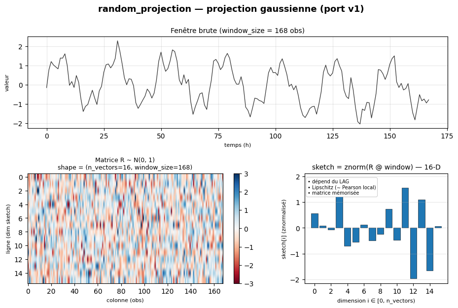
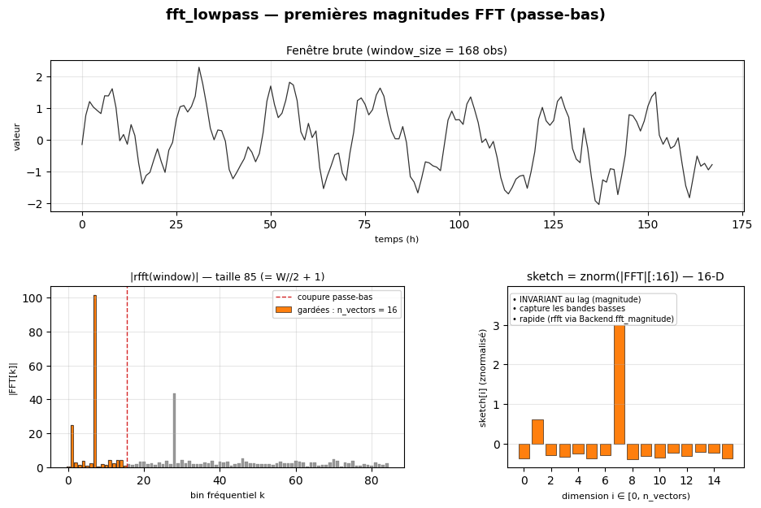
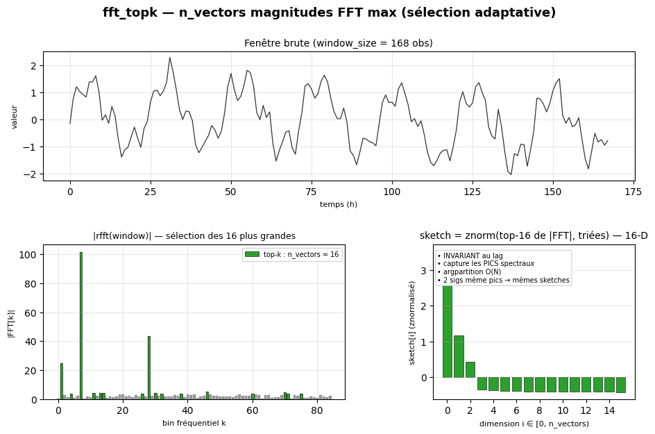
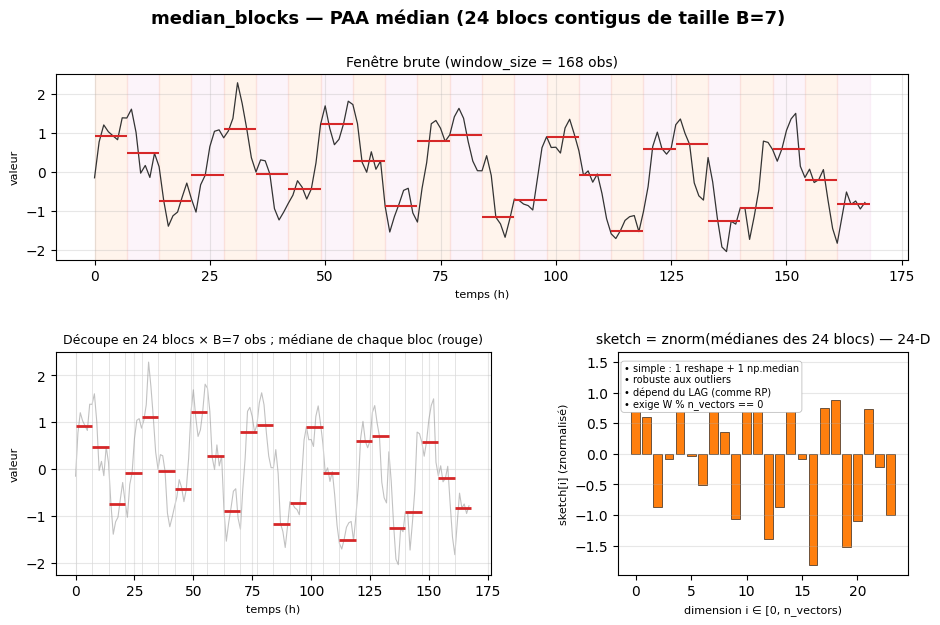
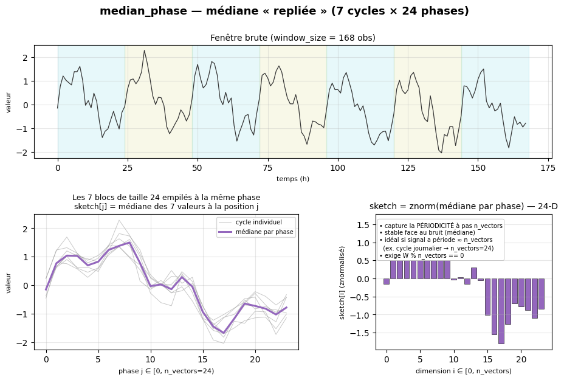

# CorrTrack v2 — sketch methods

> 📚 See also: [INDEXES.md](INDEXES.md) (the 13 candidate indexes downstream of
> the sketch) · [fillcorr.md](fillcorr.md) (alternative FilCorr algorithm) ·
> [README.md](README.md) (overview).


The **sketch** turns a raw window (~`window_size` observations, 168 by default)
into an **n_vectors**-D vector (16 by default) that summarizes the window. Two
correlated windows must have **close sketches** — that is what lets the
candidate index filter quickly (radius / kNN / hash).

`Config.sketch_method` picks the method:

| `sketch_method` | Idea | Lag invariance | When to use it |
|---|---|---|---|
| `random_projection` (default, v1 port) | Gaussian matrix `N(0,1)` × window | **NO** (locally Lipschitz) | reasonable recall + maximum speedup; signals WITHOUT lag |
| `fft_lowpass` | first `n_vectors` `\|FFT\|` magnitudes | **YES** (magnitude) | periodic/smooth signals, unknown lag |
| `fft_topk` | `n_vectors` LARGEST `\|FFT\|` magnitudes (argpartition) | **YES** | signals with dominant spectral peaks — **very high recall** |
| `median_blocks` | median per contiguous block (median PAA) | **NO** | **simple** sketch, robust to noise; coarse shape descriptor |
| `median_phase` | "folded" median at constant phase | **YES** (if period = `n_vectors`) | **periodic** signals with step `n_vectors` (e.g. daily → 24) |

All of them return a vector **z-normalized** through `backend.znormalize`. The
FFT computation itself goes through `backend.fft_magnitude(values)`: numpy by
default (MKL/Accelerate), **MPS** override through `torch.fft.rfft` on GPU.

> **Incompatible with `basic_window > 0`**: the incremental sketch is only
> defined for `random_projection` (linearity per sub-window, no simple analogue
> for FFT magnitudes).

---

## `random_projection` — Gaussian projection (v1 port)



**Idea.** Draw a matrix `R ∈ ℝ^{n_vectors × window_size}` with independent
`~ N(0, 1)` coefficients (fixed seed → reproducible), then:

```
sketch = znormalize(R @ window)
```

**Theory.** Johnson-Lindenstrauss lemma: the projection preserves Euclidean
distances up to `(1 ± ε)`, with `ε ~ 1/√n_vectors`. Two windows that are
similar in `L²` → sketches similar in `L²` → Euclidean distance on the sketches
≈ distance on the raw windows.

**Limitations.**
- **NO lag invariance**: a time shift `window[t-Δ]` produces a very different
  sketch. To detect a correlation at a non-zero lag, the pipeline aligns the
  pairs through `n_lags` after the candidate phase.
- The projection is frozen at init; the same `seed` produces the same `R`.

**Parameters:** `n_vectors`, `seed`. Compatible with `basic_window > 0` →
`IncrementalSketcher` (incremental sketch over cached sub-windows + sign
toggle).

---

## `fft_lowpass` — FFT magnitudes (low-pass)



**Idea.** Compute the FFT of the window (`rfft` for real signals) and keep the
**first `n_vectors` magnitudes** (DC + low harmonics). Since we take
`|FFT[k]|`, the phase information disappears → the sketch is **invariant to
time shifts** (a shift multiplies by `e^{-jωΔ}`, which vanishes in the
modulus).

```
sketch = znormalize(|rfft(window)|[:n_vectors])
```

**When to use it.** Signals whose energy concentrates in the low frequencies
(daily/weekly cycles, smooth trends). High-frequency peaks (noise, transients)
are discarded — good signal-to-noise ratio.

**Parameter:** `n_vectors` (≤ `window_size // 2 + 1`).

**Limitations.**
- Throws away all the high-frequency information (dominant spectral peaks in HF
  → invisible).
- No tuning: the cutoff is fixed at `n_vectors`.

---

## `fft_topk` — Top-k FFT magnitudes (adaptive)



**Idea.** Compute the FFT and keep the **`n_vectors` largest magnitudes**, no
matter their frequency. **Per-window adaptive** selection through
`np.argpartition` (O(N), not O(N log N)). The retained magnitudes are **sorted
in decreasing order** to normalize across windows: two windows with the same
peaks in different bins will have close sketches.

```
top = np.argpartition(|FFT|, -n_vectors)[-n_vectors:]
sketch = znormalize(sort_desc(|FFT|[top]))
```

**When to use it.** Signals with dominant spectral peaks (multiple
seasonalities, modulated signals, occasional frequency anomalies). In practice
it gives the **highest recall** of the three methods (measured 0.995 vs 0.43
for `random_projection` on a simple test) — at the cost of lower selectivity
(more candidates), offset by the downstream Pearson validation.

**Parameter:** `n_vectors` (≤ `window_size // 2 + 1`).

**Limitations.**
- Two uncorrelated signals with the **same amplitudes** in different bins will
  produce close sketches → false candidates (filtered by the downstream
  Pearson, so precision = 1.0 is preserved).
- FFT cost > random_projection matmul on very small windows (but MKL
  Accelerate/MPS catches up quickly at `window_size ≥ 256`).

---

---

## `median_blocks` — Median PAA over contiguous blocks



**Idea.** Split the window into `n_vectors` **contiguous blocks** of size
`B = window_size // n_vectors`, and keep the **median** of each:

```
sketch[i] = median( window[i·B : (i+1)·B] )
```

A single numpy line: `np.median(window.reshape(n_vectors, B), axis=1)`. Robust
to outliers (median ≠ mean) — an isolated spike does not disturb the block that
contains it. Compresses the window while keeping the local central value.

**Parameters:** `n_vectors`, `window_size`. **Constraint**:
`window_size % n_vectors == 0` (explicit error otherwise — adjust `n_vectors`
or `window_size`).

**When to use it.**
- **Simple** and readable sketch (1 reshape + 1 median).
- **Noisy** data where the mean would be disturbed.
- As a **coarse shape descriptor**; sensitive to lag (like
  `random_projection`).

**Limitations.** No lag invariance. Loses the intra-block high-frequency
information (by construction).

---

## `median_phase` — "Folded" median per phase



**Idea.** Split the window into `n_blocks = window_size // n_vectors` **regular
blocks** of size `n_vectors`, then take the **median at the same position in
each block**:

```
sketch[j] = median( window[j], window[j + n_vectors],
                    window[j + 2·n_vectors], …,
                    window[j + (n_blocks−1)·n_vectors] )

   j ∈ [0, n_vectors)
```

One numpy line: `np.median(window.reshape(n_blocks, n_vectors), axis=0)`.

Geometrically, the blocks are **stacked** as `n_blocks` superimposed cycles and
the median is taken "column by column". If the window is **periodic** with
period `n_vectors`, every stack aligns the phases → the robust median captures
the **shape of the cycle**. For hourly series with a daily cycle, set
`n_vectors = 24`.

**Parameters:** `n_vectors` (= expected period), `window_size`. **Constraint**:
`window_size % n_vectors == 0`.

**When to use it.**
- **Strongly periodic** signals with a known step (daily, weekly cycle).
- As a **seasonal pattern detector** robust to noise.
- Captures the periodicity even when the signal is shifted in time (up to a
  shift modulo `n_vectors`).

**Limitations.** The "right" `n_vectors` is the one matching the period —
otherwise the sketch loses its point (just a robust mean). The sketch has a
fixed dimension `n_vectors`; it requires `n_blocks ≥ 2` (hence
`window_size ≥ 2·n_vectors`).

---

## Supported backends

| Backend | RP | FFT (`fft_*`) | Median (`median_*`) | Notes |
|---|---|---|---|---|
| `python` | ✓ | ✓ (numpy.fft) | ✓ (np.median) | reference; `Backend.fft_magnitude` + `Backend.median` |
| `vectorized` | ✓ | ✓ | ✓ | inherits python (numpy already C-optimized) |
| `cython` | ✓ | ✓ | ✓ | inherits python (np.fft + np.median = MKL/Accelerate) |
| `parallel` / `*_parallel` | ✓ | ✓ | ✓ | **per-window** parallelism (the sketch itself does not need to be parallel) |
| `mps` | ✓ (`torch.matmul`) | ✓ (**`torch.fft.rfft` GPU**) | ✓ (**`torch.median` GPU**) | clear gain at `window_size ≥ 1024`; transfer overhead on small windows |
| `coreml` | ✓ (experimental) | numpy fallback | numpy fallback | ANE not exploited |

Sketches go through 3 backend primitives: `Backend.project` (RP via matmul),
`Backend.fft_magnitude` (FFT) and `Backend.median` (medians). The MPS backend
overrides all 3 with `torch.matmul` / `torch.fft.rfft` / `torch.median` on the
GPU device (numpy fallback if torch is missing). Cython/vectorized/parallel
**inherit** the default numpy implementation, which is already C-optimized —
Cython only rewrites what has a custom kernel (`correlate`, `pearson`,
`project`).

CLI:

```bash
python3 -m v2.corrtrack data.csv --sketch-method fft_topk
python3 -m v2.corrtrack data.csv --sketch-method fft_lowpass --sketch-backend mps
```

JSON:

```json
{"name": "corrtrack_kdtree_fft_topk_mps", "mode": "corrtrack",
 "params": {"index-backend": "kdtree", "sketch_method": "fft_topk",
            "backend": "mps"}}
```
