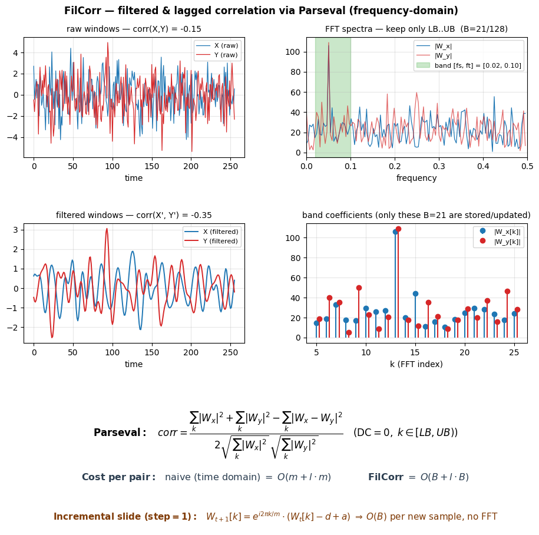

# FilCorr — v2 port

> 📚 See also: [README.md](README.md) (overview) ·
> [INDEXES.md](INDEXES.md) (13 indexes for `corrtrack` mode) ·
> [SKETCHES.md](SKETCHES.md) (5 sketches for `corrtrack` mode).


**FilCorr** (Zhong, Souza, Mueen — *ICDM 2020*): Pearson correlation over
**filtered** windows (band-pass `[fs, ft]`) computed in the frequency domain
through Parseval, with **lag**. It is the 3rd mode of the v2 pipeline, next to
`bf` and `corrtrack`.



> *Left to right, top to bottom:*
> *(1)* two very noisy raw windows — the correlation is hidden;
> *(2)* their FFT spectra, with the retained band `[fs, ft]` (green);
> *(3)* the same windows once only the in-band frequencies are kept — the useful
> correlation shows up;
> *(4)* only the `B` band coefficients are stored/updated, against `m`
> time-domain samples;
> *(5)* Parseval formula + `O(B)` cost per pair + incremental `O(B)` update per
> new sample (without an FFT).

> **Reference paper + Java JAR**: not versioned (third-party material, ~120 MB).
> Drop the reference benchmark under `v2/fillcorr/filcorr-offline-perf-bench/`
> if you need it — the path is git-ignored.
> **Standalone Python implementation**: everything lives in `v2/fillcorr/` — no
> existing v2 file is modified.

## Why

- `bf` computes the Pearson correlation on the **raw windows**.
- `filcorr` computes the correlation on the **filtered** (band-pass) windows and
  uses Parseval's identity to run the computation **directly on the FFT
  coefficients of the band**:

      corr = (Σ|Wx|² + Σ|Wy|² − Σ|Wx−Wy|²) / (2·√Σ|Wx|²·√Σ|Wy|²)

  → `O(B)` cost per pair with `B = ⌊m·ft/f⌋ − ⌊m·fs/f⌋` (band width) against
  `O(m)` for `bf`. The narrower the band, the faster it gets.

Use case: signals whose useful correlation is carried by a sub-band only
(seismic, EEG, audio…). Without the filter, out-of-band noise hides the
correlation; FilCorr extracts it at no extra cost.

## Running it (pipeline JSON)

**No wrapper, no extra module**: a JSON run with `"mode": "filcorr"` is
dispatched automatically by `v2.pipeline` (the `v2.fillcorr` sub-package
registers itself on import).

```bash
PYTHONPATH=/path/to/CorrTrack python3 -m v2.pipeline my_pipeline.json
```

Example comparing bf, filcorr (no filter) and band-pass filcorr:

```json
{
  "name": "compare_filcorr",
  "dataset": "fr-air_temperature.csv",
  "baseline": 0,
  "clean": true,
  "params": { "n_series": 5, "n_years": 1, "neg_corr": false, "std_threshold": 0.001 },
  "runs": [
    { "name": "bf_ref",       "mode": "bf",      "params": { "backend": "vectorized" } },
    { "name": "filcorr_full", "mode": "filcorr",
      "params": { "filcorr_fs": 0.0, "filcorr_ft": 0.5, "filcorr_backend": "vectorized" } },
    { "name": "filcorr_band", "mode": "filcorr",
      "params": { "filcorr_fs": 0.01, "filcorr_ft": 0.1, "filcorr_backend": "cython" } }
  ]
}
```

Outputs are identical to the other modes: `results/<name>/<run>/correlated.csv`,
`episodes.csv`, `anomalies.csv`, `summary.csv`, `run.log` plus the global
`comparison.csv`. The `comparison.csv` columns (`speedup`, `recall`,
`precision`, …) work as-is: filcorr is measured against the baseline (`bf`
usually).

## FilCorr parameters

All prefixed with `filcorr_` and placed in the `params` of a JSON run:

| param | default | description |
|---|---|---|
| `filcorr_fs` | `0.0` | lower bound of the pass-band (Hz) |
| `filcorr_ft` | `0.5` | upper bound of the pass-band (Hz) — Nyquist by default |
| `filcorr_sampling_rate` | `1.0` | sampling frequency `f` (Hz); set to 1 if fs/ft are fractions of Nyquist |
| `filcorr_backend` | inherited from `backend` | FilCorr backend: `python` \| `vectorized` \| `parallel` \| `cython` \| `mps` |

With `fs=0.0, ft=0.5` (and the `LB ≥ 1` convention that systematically removes
the DC component) we get the **standard Pearson correlation** back →
recall/precision = 1.0 against `bf`, but faster in practice.

The other shared parameters (`window_size`, `window_step`, `n_lags`,
`corr_threshold`, `neg_corr`, `std_threshold`, `n_series`, `n_years`, …) are
the v2 pipeline ones.

## Backends

| `filcorr_backend` | Kernel | Parallel | Notes |
|---|---|---|---|
| `python` | naive: time-domain filtering through IFFT + Pearson | no | cross-check reference; identical results to the others |
| `vectorized` | numpy: batched `np.fft.fft` + `np.einsum` | no | fast default |
| `parallel` | `vectorized` spread over N processes (`ProcessPool`) | yes (`max_workers`) | the pairwise correlation is split into chunks |
| `cython` | compiled C kernel (pure Parseval) | no | falls back to `vectorized` if Cython is missing; compiles on first run |
| `mps` | `torch.fft` on Apple Silicon GPU | — | float32 → ~1e-7 error; CPU fallback if PyTorch/MPS are missing |

## Algorithm (summary)

For every sliding window of size `m` at time `t`:

1. Compute `Wᵗ` = FFT(window) and keep only the coefficients inside the band
   `[LB, UB)` with `LB = ⌊m·fs/f⌋`, `UB = ⌊m·ft/f⌋` (and `LB ≥ 1` to force the
   DC removal required by the Parseval derivation).
2. For every pair `(X@t, Y@t')` with `|t − t'| ≤ n_lags`, compute the Parseval
   correlation (`O(B)` instead of `O(m)`).
3. Keep it if `|corr| ≥ corr_threshold` (signed lag = `t_X − t_Y`).

**Streaming case (1-sample slide)**: the `B` band coefficients can be updated in
`O(B)` without redoing the FFT (see `algo.incremental_update`). The v2 pipeline
uses `window_step=12` by default → a full band FFT is recomputed per window
(still `O(m log m)`, but with a practical constant **lower** than the batched
time-domain correlation because far fewer coefficients are involved).

## Module layout

```
v2/fillcorr/
├── __init__.py        # exposes run(), FilCorrParams + installs the mode hooks on import
├── runner.py          # orchestration (read/windows/band_fft/pairs/validate/monitor)
├── algo.py            # math: band_indices, full_band_fft, parseval_corr, incremental_update,
│                      #       naive_filtered_pearson (reference)
├── backends.py        # 5 backends: python, vectorized, parallel, cython, mps
└── _kernels.pyx       # Cython kernel compiled on first import (through pyximport)
```

## Limits / notes

- **No pollution**: this module modifies no existing v2 file. The `filcorr` mode
  is only recognized through `v2.fillcorr` (whose import monkey-patches
  `core.pipeline.run`); the historical `v2.pipeline` stays intact for
  `bf`/`corrtrack`.
- **Pipeline table display**: the `backend` column of the final summary shows
  the standard v2 backend of the Config (not `filcorr_backend`) — this is
  cosmetic. The value actually used is logged when the run starts
  (`params | filcorr: … backend=…`).
- **MPS precision**: float32 on GPU → ~1e-7 deviation vs CPU, with no practical
  effect on the correlation threshold.
- **Cython**: compiles on first call through `pyximport`; requires `cython` +
  `numpy` headers. Transparent fallback to `vectorized`.
- **With `fs=0` / `ft=0.5`** (see the table), FilCorr ≡ standard Pearson on
  z-normalized signals: the rare deviations (~0.01% of the corrs on fr-air) are
  threshold effects at floating-point precision around `corr_threshold`.
